# MLP-Multi-Layer-Perceptron (MNIST) - L2 & Dropout

By Leon Davis.

Este proyecto implementa una red neuronal perceptrón multicapa (MLP) entrenada para reconocer dígitos del 0 al 9 utilizando el dataset MNIST. Se ha desarrollado en C++ usando CMake como sistema de construcción y OpenCV para el manejo de imágenes.

## 🔧 Requisitos

* CMake >= 3.10
* OpenCV >= 4.0

Asegúrate de tener instalados los requisitos antes de compilar.

## Instalación

Clona el repositorio y entra en la carpeta del proyecto:

```bash
git clone https://github.com/LeonDavisCoropuna/MLP-Multi-Layer-Perceptron.git
cd MLP-Multi-Layer-Perceptron
```

Dale permisos de ejecución al script principal:

```bash
chmod +x run.sh
```

Ejecuta el script para compilar y correr:

```bash
./run.sh main
```

## Evaluación
Se implementaron 5 casos con la misma arquitectura de 784x64x32x10:
- Arquitectura normal.
- Arquitectura con dropout de 0.2 entre capas
- Arquitectura con weight decay de 0.01
- Arquitectura con dropout 0.2 y weight decay 0.0005
- Arquitectura con dropout 0.2 y weight decay 0.01

### Caso 1 (sin drop ni weight decay):
```cpp
float learning_rate = 0.001f;
float wd = 0;

Optimizer *adam = new Adam(learning_rate, 0);
MLP mlp(learning_rate, adam);

mlp.add_layer(new DenseLayer(784, 64, new ReLU(), adam));
mlp.add_layer(new DenseLayer(64, 32, new ReLU(), adam));
mlp.add_layer(new DenseLayer(32, 10, new Softmax(), adam));
mlp.set_loss(new CrossEntropyLoss());
```

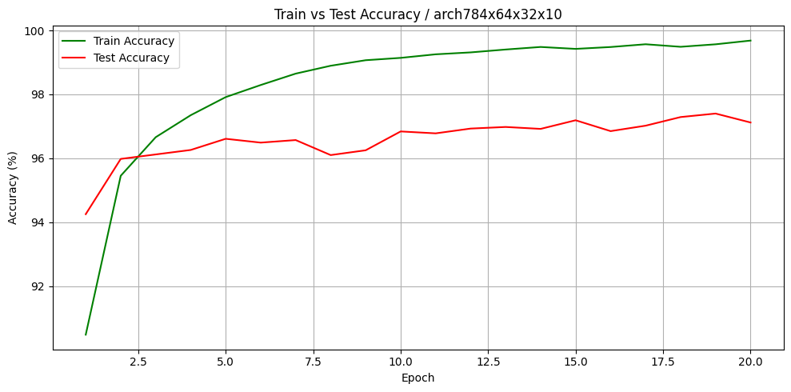
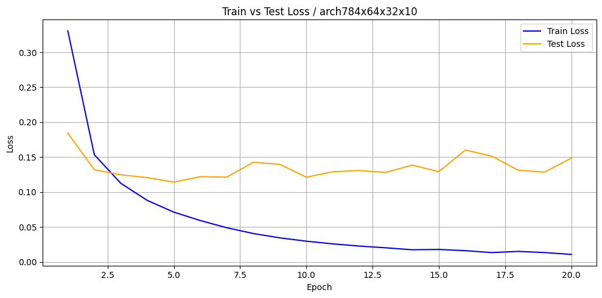

Mejor Tess Accuracy en Epoch 19:
  - Train Loss     : 0.0133
  - Train Accuracy : 99.57%
  - Test Loss      : 0.1286
  - Test Accuracy  : 97.40%

El modelo logró una alta precisión en el conjunto de entrenamiento (99.57%), lo que indica un ajuste casi perfecto a los datos de entrenamiento. Sin embargo, con la precisión de test (97.40%) se ve  un ligero sobreajuste. Sin embargo, el sobreajuste empieza desde el epoch 2 y desde allí la mejora del test no es tan evidente mientras que la mejora del train sigue aumentando sin parar.


### Caso 2 (solo drop)

```cpp
float learning_rate = 0.001f;
float wd = 0;

Optimizer *adam = new Adam(learning_rate, wd);
MLP mlp(learning_rate, adam);

mlp.add_layer(new DenseLayer(784, 64, new ReLU(), adam));
mlp.add_layer(new DropoutLayer(0.2));
mlp.add_layer(new DenseLayer(64, 32, new ReLU(), adam));
mlp.add_layer(new DropoutLayer(0.2));
mlp.add_layer(new DenseLayer(32, 10, new Softmax(), adam));
mlp.set_loss(new CrossEntropyLoss());
```

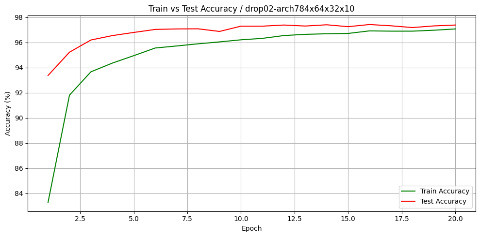
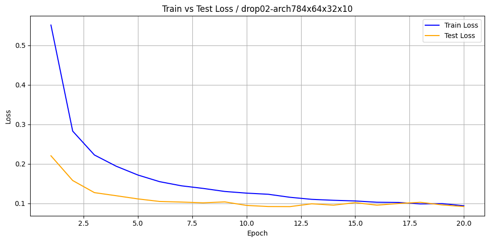

Mejor Tess Accuracy en Epoch 16:
  - Train Loss     : 0.1026
  - Train Accuracy : 96.92%
  - Test Loss      : 0.0952
  - Test Accuracy  : 97.43%

El mejor modelo, la inclusión de dropout ayudó a reducir el sobreajuste, como lo evidencia el aumento en la precisión de prueba (97.43%) con respecto al caso base, aunque con una menor precisión de entrenamiento.

### Caso 3 (solo weight decay)

```cpp
float learning_rate = 0.001f;
float wd = 0.0005f;

Optimizer *adam = new Adam(learning_rate, wd);
MLP mlp(learning_rate, adam);

mlp.add_layer(new DenseLayer(784, 64, new ReLU(), adam));
mlp.add_layer(new DenseLayer(64, 32, new ReLU(), adam));
mlp.add_layer(new DenseLayer(32, 10, new Softmax(), adam));
mlp.set_loss(new CrossEntropyLoss());
```

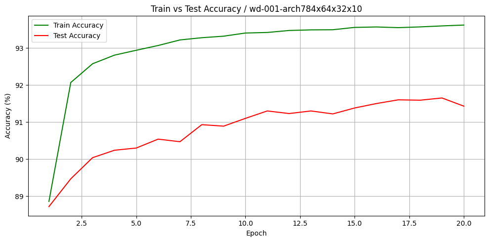
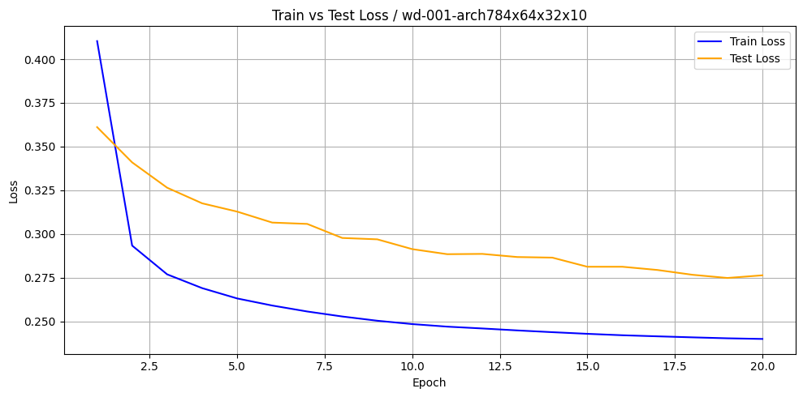

Mejor Tess Accuracy en Epoch 19:
  - Train Loss     : 0.2403
  - Train Accuracy : 93.59%
  - Test Loss      : 0.2748
  - Test Accuracy  : 91.65%

El weight decay aplicado fue probablemente demasiado fuerte, lo que resultó en una reducción significativa del rendimiento tanto en entrenamiento como en prueba (Train: 93.59%, Test: 91.65%). Este caso muestra cómo una penalización excesiva puede dificultar el aprendizaje.

### Caso 4 (drop 0.2 y wd 0.01)

```cpp
float learning_rate = 0.001f;
float wd = 0.01f;

Optimizer *adam = new Adam(learning_rate, wd);
MLP mlp(learning_rate, adam);

mlp.add_layer(new DenseLayer(784, 64, new ReLU(), adam));
mlp.add_layer(new DenseLayer(64, 32, new ReLU(), adam));
mlp.add_layer(new DenseLayer(32, 10, new Softmax(), adam));
mlp.set_loss(new CrossEntropyLoss());
```

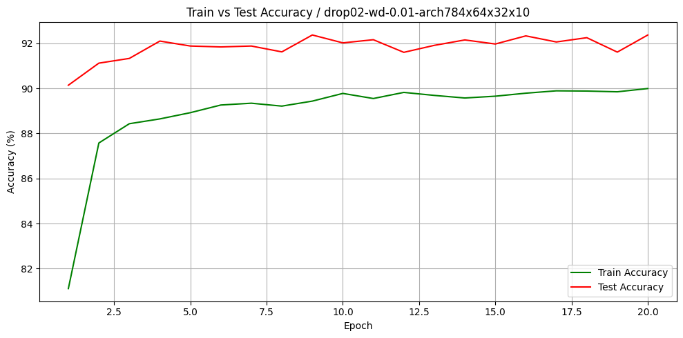
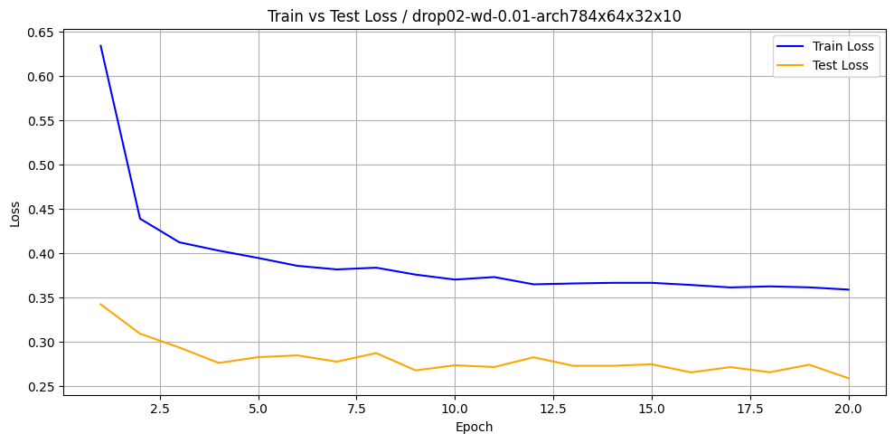

Mejor Tess Accuracy en Epoch 9:
  - Train Loss     : 0.3758
  - Train Accuracy : 89.44%
  - Test Loss      : 0.2678
  - Test Accuracy  : 92.37%

Este enfoque combinó dos técnicas de regularización, pero el valor alto de weight decay nuevamente afectó negativamente el aprendizaje. Aunque el modelo evitó el sobreajuste (Train: 89.44%, Test: 92.37%), su capacidad de alcanzar altos niveles de precisión fue limitada. Este experimento confirma que una penalización muy fuerte no se compensa con dropout.

### Caso 5 (drop 0.2 y wd 0.0005)

```cpp
float learning_rate = 0.001f;
float wd = 0.0005f;

Optimizer *adam = new Adam(learning_rate, wd);
MLP mlp(learning_rate, adam);

mlp.add_layer(new DenseLayer(784, 64, new ReLU(), adam));
mlp.add_layer(new DenseLayer(64, 32, new ReLU(), adam));
mlp.add_layer(new DenseLayer(32, 10, new Softmax(), adam));
mlp.set_loss(new CrossEntropyLoss());
```

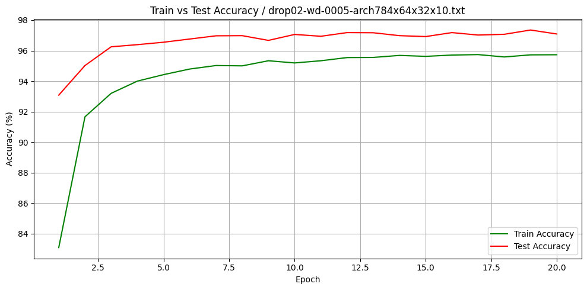


Mejor Tess Accuracy en Epoch 19:
  - Train Loss     : 0.1456
  - Train Accuracy : 95.72%
  - Test Loss      : 0.0866
  - Test Accuracy  : 97.35%

Esta combinación equilibrada produjo uno de los mejores resultados generales, con alta precisión en test (97.35%) y buena capacidad de generalización. El modelo evitó el sobreajuste severo y logró un rendimiento comparable al mejor caso (caso 2), pero con una regularización más controlada. Es una configuración óptima entre complejidad y generalización.

### Recopilación
#### Gráfica de de loss solo en el conjunto de tess

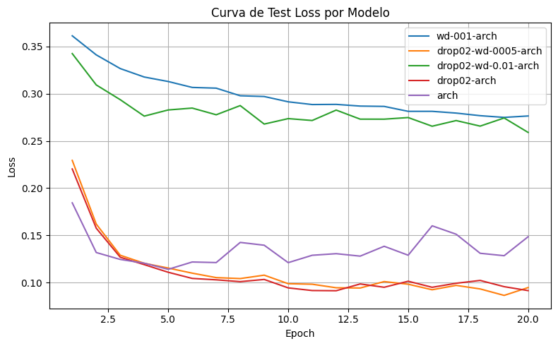

Directamente aquí se observa que aplicar un L2 con valor de 0.01 aumenta la perdida de los modelos al ser un valor muy grande, es mucho mejor un valor mas pequeño como 0.0005. También es notorio que la curva del modelo sin L2 ni dropout empieza bien, pero conforme aumentan los epochs cada vez aumenta su perdida indicando que el sobreajuste se hará mayor a más epochs.

#### Gráfica de accuracy solo en el conjunto de tess

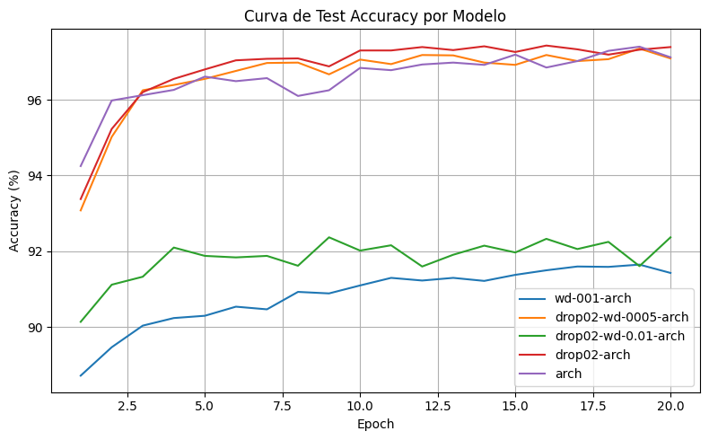
Aquí se observa que al igual que en loss los peores modelos son los que tienen un L2 de 0.01. El accuracy de los otros modelos es muy bueno, y el que reslta más es el que implementa solo dropout alcanzando el mayor accuracy.

## Conclusiones

### 1. El uso de dropout mejoró la generalización del modelo sin afectar significativamente la precisión.
En el segundo caso (solo dropout), se observó una mayor regularización respecto al modelo base. Aunque la precisión en entrenamiento disminuyó ligeramente (96.92% frente a 99.57%), la precisión en test fue incluso superior (97.43% vs. 97.40%), con menor test loss. Esto indica que el dropout ayudó a prevenir el sobreajuste.

### 2. El weight decay por sí solo no fue suficiente y redujo notablemente la capacidad del modelo.
En el tercer caso (solo weight decay), la precisión en test cayó a 91.65% y la pérdida fue mucho mayor que en los demás casos demotrando que un alto valor de L2 (0.01) afectaría negativamente al modelo incluso añadiendo dropout.

### 3. La combinación de dropout y weight decay moderado logró un buen equilibrio entre regularización y rendimiento.
El quinto caso (dropout 0.2 + weight decay 0.0005) logró un rendimiento muy competitivo con 97.35% de test accuracy y el menor test loss (0.0866) de todos los casos. Esta combinación favoreció tanto la regularización como la capacidad de aprendizaje, logrando un modelo robusto y eficaz. A diferencia del cuarto caso (dropout + wd 0.01), donde un wd más alto redujo significativamente el rendimiento, esta configuración muestra que la sinergia entre técnicas debe mantenerse en valores equilibrado

## Ver código en github:
La parte principal del código se encuentra en la carpeta models/ (MLP, layers) y en utils/ (optimizadores, funciones de perdida y activación)
```bash
https://github.com/LeonDavisCoropuna/MLP-Multi-Layer-Perceptron.git
```