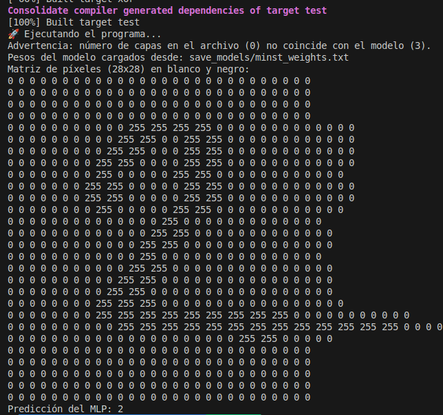
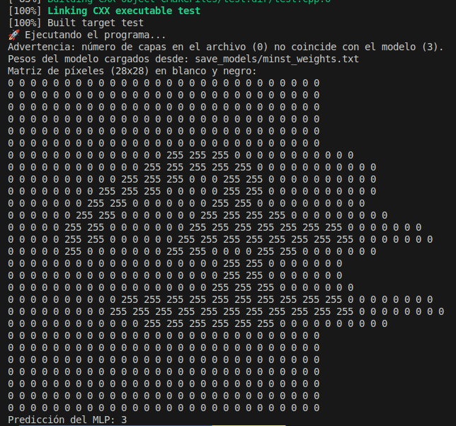
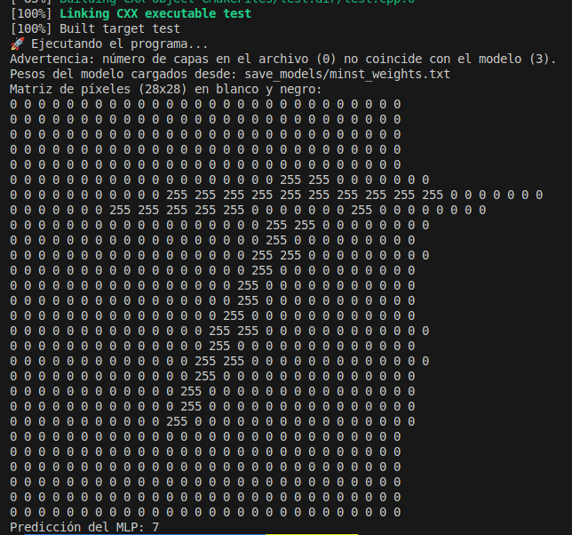

# MLP-Multi-Layer-Perceptron (MNIST)

By Leon Davis.

Este proyecto implementa una red neuronal perceptrón multicapa (MLP) entrenada para reconocer dígitos del 0 al 9 utilizando el dataset MNIST. Se ha desarrollado en C++ usando CMake como sistema de construcción y OpenCV para el manejo de imágenes.

## 🔧 Requisitos

* CMake >= 3.10
* OpenCV >= 4.0

Asegúrate de tener instalados los requisitos antes de compilar.

## 🚀 Instalación

Clona el repositorio y entra en la carpeta del proyecto:

```bash
git clone https://github.com/LeonDavisCoropuna/MLP-Multi-Layer-Perceptron.git
cd MLP-Multi-Layer-Perceptron
```

Dale permisos de ejecución al script principal:

```bash
chmod +x run.sh
```

Ejecuta el script para compilar y correr:

```bash
./run.sh
```

## 📁 Estructura del proyecto

```bash
tree --dirsfirst -I 'mnist_data|build|venv'
.
├── images
│   ├── and_tanh_sigmoid_console.png
│   ├── or_tanh_sigmoid_console.png
│   ├── result_minst_20_epochs.png
│   ├── result_minst_30_epochs.png
│   ├── xor_relu_relu_console.png
│   ├── xor_relu_relu.png
│   ├── xor_sigmoid_sigmoid_console.png
│   ├── xor_sigmoid_sigmoid.png
│   ├── xor_tanh_sigmoid_console.png
│   ├── xor_tanh_sigmoid.png
│   ├── xor_tanh_tanh_console.png
│   └── xor_tanh_tanh.png
├── models
│   ├── MLP.hpp
│   ├── perceptron.hpp
│   └── singleLayerPerceptron.hpp
├── numbers
│   ├── Captura desde 2025-05-19 16-56-22.png
│   ├── Captura desde 2025-05-19 16-58-38.png
│   ├── Captura desde 2025-05-19 17-06-35.png
│   ├── ...
│   ├── ...
│   ├── ...
│   ├── convert.py
├── save_models
│   ├── minst_test.txt
│   ├── minst_weights.txt
├── utils
│   ├── activations.hpp
│   ├── load_dataset.hpp
│   ├── loss.hpp
│   ├── optimizer.hpp
│   └── test_image.hpp
├── mnist_data
│   ├── train
│   │   ├── 0
│   │   ├── 1
│   │   └── ...
│   └── test
│       ├── 0
│       ├── 1
│       └── ...
├── CMakeLists.txt
├── Lab3_MLP_Leon_Davis.pdf
├── LICENSE
├── main.cpp
├── README.md
├── README_XOR.md
├── run.sh
├── test.cpp
├── training_outputs.txt
└── xor.cpp

5 directories, 43 files
```

> **Nota:** La carpeta `mnist_data` contiene dos subcarpetas (`train` y `test`) con las imágenes del dataset MNIST organizadas por dígito.

## 🧠 Funcionalidades útiles

### 🔹 Cargar pesos preentrenados

Puedes cargar pesos guardados previamente utilizando:

```cpp
mlp.load_model_weights("save_models/minst_weights.txt");
```

### 🔹 Predecir a partir de una imagen

Para predecir un dígito a partir de una imagen personalizada:

```cpp
flatten_image_to_vector_and_predict("numbers/cinco_5.png", mlp);
```

Esto cargará la imagen `cinco_5.png`, la preprocesará y mostrará la predicción del modelo MLP entrenado.

Claro, continuemos con la sección **## Implementación** explicando el código del `MLP` (Multi-Layer Perceptron) paso a paso.

## 🛠️ Implementación

A continuación, se presenta una clase `MLP` que representa una red neuronal multicapa (Multi-Layer Perceptron) en C++. Esta implementación se basa en la clase `SingleLayerPerceptron` y proporciona funcionalidades para entrenamiento, evaluación, predicción y guardado/carga de pesos del modelo.

### 🔧 Atributos principales

```cpp
float learning_rate;
vector<int> num_layers;
int num_inputs;
vector<SingleLayerPerceptron *> layers;
vector<vector<float>> output_layers;
vector<ActivationFunction *> activations;
Loss *loss_function;
int last_output_size = -1;
Optimizer *optimizer;
```

* `learning_rate`: tasa de aprendizaje usada en la actualización de pesos.
* `num_layers`: vector que define la cantidad de neuronas por capa.
* `layers`: cada elemento representa una capa `SingleLayerPerceptron`.
* `activations`: funciones de activación por capa.
* `loss_function`: función de pérdida (e.g. MSE, CrossEntropy).
* `optimizer`: permite usar distintos optimizadores (SGD, Adam, etc.).
* `last_output_size`: usado para conectar capas dinámicamente.
* `output_layers`: almacena las salidas de cada capa tras un `forward`.

### 🧱 Constructores

#### Constructor con arquitectura definida:

```cpp
MLP(float _learning_rate, vector<int> _num_layers,
    vector<ActivationFunction *> _activations, Loss *_loss_function)
```

* Define la arquitectura completa de entrada.
* Instancia cada `SingleLayerPerceptron` con su función de activación correspondiente.

#### Constructor dinámico:

```cpp
MLP(float _learning_rate, Optimizer *_optimizer)
```

* Permite construir la red dinámicamente usando `add_input_layer` y `add_layer`.

### ➕ Métodos de construcción

#### Añadir capa de entrada:

```cpp
void add_input_layer(int input_size, int num_neurons, ActivationFunction *activationFunction)
```

* Inicializa la red con la capa de entrada.

#### Añadir capas ocultas:

```cpp
void add_layer(int num_neurons, ActivationFunction *activationFunction)
```

* Añade una capa oculta o de salida, usando la salida previa como entrada.

### 🔮 Predicción

#### `int predict(const vector<float> &input)`

* Aplica un `forward` y devuelve la clase predicha:

  * Binario: si solo hay una salida, umbral de 0.5.
  * Multiclase: índice de la salida con valor más alto.

### 🔁 Forward propagation

```cpp
vector<float> forward(vector<float> batch_inputs)
```

* Calcula la salida de la red hacia adelante, almacenando cada salida intermedia.

### 🎓 Entrenamiento

```cpp
void train(int num_epochs, const vector<vector<float>> &X, const vector<float> &Y)
```

* Entrena la red:

  1. Para cada epoch, se recorre todo el dataset.
  2. Se realiza `forward` para cada muestra.
  3. Se calcula la pérdida (loss).
  4. Se realiza backpropagation:

     * Se propaga el error desde la última capa (`backward_output_layer`) hacia las ocultas (`backward_hidden_layer`).
     * Se actualizan los pesos (`update_weights`).
  5. Imprime la pérdida y precisión por epoch.


### 📊 Evaluación

```cpp
float evaluate(const vector<vector<float>> &X_test, const vector<float> &Y_test)
```

* Evalúa la red sobre datos de prueba.
* Calcula e imprime la precisión final.


### 💾 Guardado de pesos

```cpp
void save_model_weights(const std::string &filename)
```

* Guarda los pesos de cada neurona en un archivo de texto plano.
* Formato legible, útil para análisis o reproducibilidad.

### 📂 Carga de pesos

```cpp
void load_model_weights(const std::string &filename)
```

* Carga los pesos desde un archivo previamente guardado.
* Verifica consistencia en cantidad de capas y neuronas.

### 🧹 Destructor

```cpp
~MLP()
```

* Libera memoria reservada dinámicamente para las capas, funciones de activación y pérdida.

## Utilidades

### 🔧 **Clases de Funciones de Activación**

Cada clase hereda de `ActivationFunction`, una interfaz base que define el comportamiento general de las funciones de activación: `activate()`, `derivative()`, `initialize_weights()` y `activate_vector()` (opcional).

#### 🔸 `ReLU` (Rectified Linear Unit)

* **`activate(x)`**: devuelve `x` si es positivo, `0` si es negativo.
* **`derivative(x)`**: devuelve `1` si `x > 0`, `0` en otro caso.
* **`initialize_weights()`**: inicializa los pesos con distribución uniforme escalada con `sqrt(2 / num_inputs)` (He initialization).

#### 🔸 `Tanh`

* **`activate(x)`**: retorna `tanh(x)`, que transforma el valor a un rango entre -1 y 1.
* **`derivative(x)`**: `1 - tanh(x)^2`, que es la derivada de `tanh`.
* **`initialize_weights()`**: usa una distribución uniforme escalada por `sqrt(1 / num_inputs)` (Xavier initialization).

#### 🔸 `Sigmoid`

* **`activate(x)`**: función logística: `1 / (1 + exp(-x))`, salida entre 0 y 1.
* **`derivative(x)`**: `sigmoid(x) * (1 - sigmoid(x))`.
* **`initialize_weights()`**: igual que `Tanh`, usa Xavier initialization.

#### 🔸 `Softmax`

* Se usa generalmente en la **capa de salida** para clasificación multiclase.
* **`activate(x)`**: no aplica individualmente a un escalar. Aquí solo está por compatibilidad.
* **`activate_vector(vector)`**: aplica softmax al vector completo:

  1. Resta el valor máximo (estabilidad numérica).
  2. Aplica `exp`.
  3. Normaliza dividiendo entre la suma.
* **`derivative(x)`**: no se usa directamente.
* **`requires_special_output_gradient()`**: devuelve `true`, indicando que debe manejarse especialmente (como en `cross-entropy + softmax`).


### 📦 **Carga de Dataset: `load_dataset()`**

Esta función carga un conjunto de imágenes PNG en escala de grises desde una carpeta:

1. **Detecta etiquetas** en el nombre del archivo con regex (`label_N.png`).
2. **Lee imágenes** con OpenCV (`cv::imread`).
3. **Normaliza** cada píxel a rango `[0, 1]`.
4. **Aplana** la imagen a un vector 1D.
5. Devuelve un `pair`: lista de imágenes (`X`) y etiquetas (`Y`).

### 🔍 **Predicción desde Imagen: `flatten_image_to_vector_and_predict()`**

Función útil para probar el modelo con una imagen individual.

1. Lee la imagen en escala de grises.
2. La redimensiona a 28×28 (como MNIST).
3. La binariza (blanco y negro) con un **umbral** de 128.
4. Muestra la matriz 28×28 por consola.
5. Aplana y normaliza la imagen.
6. Llama al método `predict()` del MLP y muestra el resultado.

### ⚙️ **Optimizadores: SGD y Adam**

Ambos heredan de la clase abstracta `Optimizer`.

#### 🔸 `SGD` (Stochastic Gradient Descent)

* Actualiza los pesos con la fórmula estándar:

  $$
  w_i = w_i - \eta \cdot \frac{\partial L}{\partial w_i}
  $$

#### 🔸 `Adam` (Adaptive Moment Estimation)

* Mantiene **promedios móviles** de los gradientes y sus cuadrados:

  * `m_weights`: primer momento (media).
  * `v_weights`: segundo momento (varianza).
* Usa corrección de sesgo (`bias correction`) para ajustar `m_hat` y `v_hat`.
* Mejora la estabilidad del entrenamiento especialmente con tasas de aprendizaje más grandes.

## Entrenamiento

Este programa en C++ carga un modelo de red neuronal multicapa (MLP) para clasificar imágenes del conjunto de datos MNIST. A continuación se explica paso a paso cada parte del código:

### 1. Inclusión de cabeceras

```cpp
#include "models/MLP.hpp"
#include "utils/load_dataset.hpp"
#include <chrono>
````

Se incluyen:

* El modelo `MLP` (una red neuronal feedforward).
* La utilidad `load_dataset.hpp` para cargar datos de imagen.
* `<chrono>` para medir el tiempo de entrenamiento.

### 2. Inicialización del generador aleatorio

```cpp
mt19937 Perceptron::gen(32);
```

Se inicializa un generador de números aleatorios con semilla 32, usado probablemente en la inicialización de pesos en la clase `Perceptron`.

### 3. Función principal `main()`

#### Carga de los datos

```cpp
auto train_data = load_dataset("mnist_data/saved_images/train");
auto test_data = load_dataset("mnist_data/saved_images/test");
```

* Se cargan las imágenes de entrenamiento y prueba desde las carpetas locales.
* `train_data` y `test_data` son pares `std::pair<vector, vector>` con imágenes y etiquetas.

```cpp
std::cout << "Cargadas " << train_data.first.size() << " imágenes de entrenamiento." << std::endl;
std::cout << "Cargadas " << test_data.first.size() << " imágenes de prueba." << std::endl;
```

Se imprime cuántas imágenes se han cargado.

### 4. Configuración del modelo MLP

```cpp
float learning_rate = 0.001f;
Optimizer *sgd = new SGD(learning_rate);
MLP mlp(learning_rate, sgd);
```

* Se define la tasa de aprendizaje.
* Se instancia un optimizador `SGD`.
* Se crea un modelo MLP con ese optimizador.

```cpp
mlp.add_input_layer(784, 128, new ReLU());
mlp.add_layer(64, new ReLU());
mlp.add_layer(10, new Softmax());
mlp.set_loss(new CrossEntropyLoss());
```

* Se define la arquitectura de la red:

  * Capa de entrada: 784 neuronas (28x28 px), 128 de salida con activación ReLU.
  * Capa oculta: 64 neuronas con ReLU.
  * Capa de salida: 10 neuronas (dígitos del 0 al 9) con Softmax.
* Se define la función de pérdida como entropía cruzada.

### 5. Medición del tiempo de entrenamiento

```cpp
auto start_time = std::chrono::high_resolution_clock::now();
```

Se inicia el conteo del tiempo.

```cpp
mlp.train(30, train_data.first, train_data.second);
//mlp.load_model_weights("save_models/minst_weights.txt");
```

* En el entrenamiento se indican las epocas (30) junto con los datos de entrenamiento y evaluacion
* En caso de haber entrenado el modelo anteriormente ya no es necesario entrenar desde cero, se cargan pesos preentrenados.

```cpp
auto end_time = std::chrono::high_resolution_clock::now();
std::chrono::duration<double> duration = end_time - start_time;
std::cout << "Tiempo total de entrenamiento: " << duration.count() << " segundos" << std::endl;
```

Se calcula e imprime el tiempo total que tomó cargar el modelo (o entrenarlo, si se usa la línea comentada). Luego se prueba el modelo en el conjunto de evaluación y se imprime el accuracy.

* Ejemplo de salida en el entrenamiento


### Notas adicionales

También se muestran líneas comentadas para:

* Entrenar el modelo.
* Evaluar todo el conjunto de prueba.
* Guardar los pesos del modelo entrenado.

Estas funcionalidades están disponibles y pueden activarse fácilmente.

## Ejemplos de salidas






