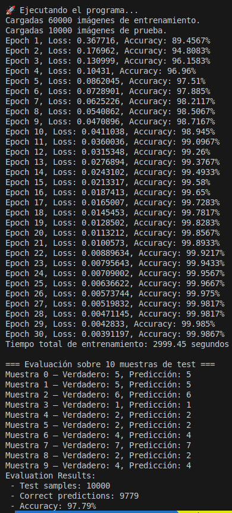
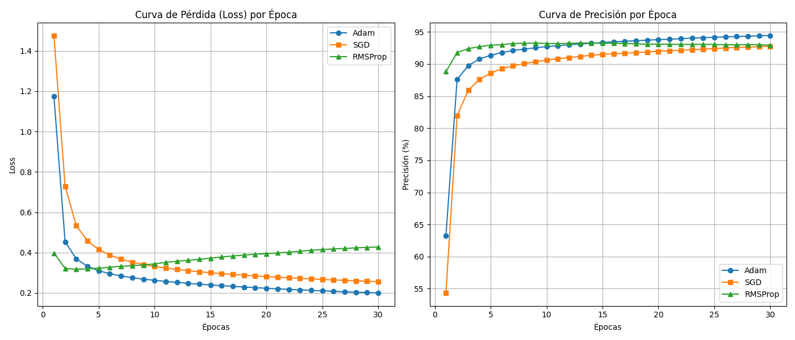
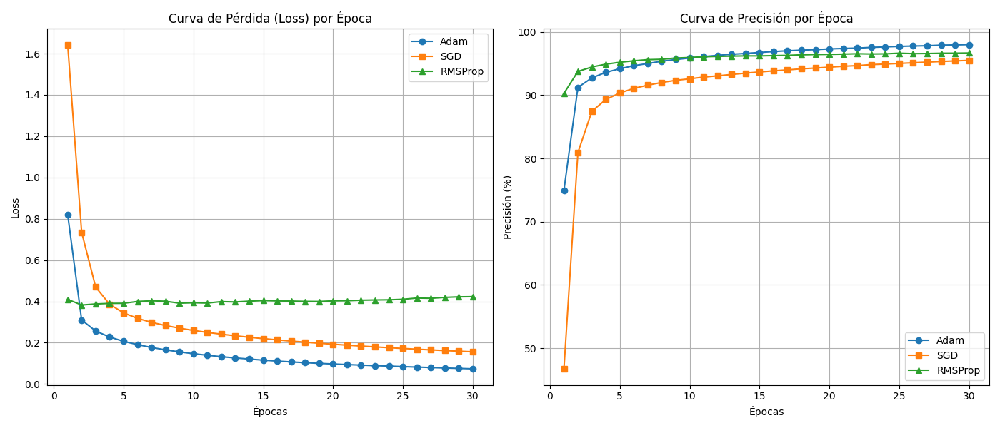

# MLP-Multi-Layer-Perceptron (MNIST) - Optimizadores

By Leon Davis.

Este proyecto implementa una red neuronal perceptrón multicapa (MLP) entrenada para reconocer dígitos del 0 al 9 utilizando el dataset MNIST. Se ha desarrollado en C++ usando CMake como sistema de construcción y OpenCV para el manejo de imágenes.

## 🔧 Requisitos

* CMake >= 3.10
* OpenCV >= 4.0

Asegúrate de tener instalados los requisitos antes de compilar.

## 🚀 Instalación

Clona el repositorio y entra en la carpeta del proyecto:

```bash
git clone https://github.com/LeonDavisCoropuna/MLP-Multi-Layer-Perceptron.git
cd MLP-Multi-Layer-Perceptron
```

Dale permisos de ejecución al script principal:

```bash
chmod +x run.sh
```

Ejecuta el script para compilar y correr:

```bash
./run.sh
```

## 📁 Estructura del proyecto

```bash
tree --dirsfirst -I 'mnist_data|build|venv'
.
├── images
│   ├── and_tanh_sigmoid_console.png
│   ├── or_tanh_sigmoid_console.png
│   ├── result_minst_20_epochs.png
│   ├── result_minst_30_epochs.png
│   ├── xor_relu_relu_console.png
│   ├── xor_relu_relu.png
│   ├── xor_sigmoid_sigmoid_console.png
│   ├── xor_sigmoid_sigmoid.png
│   ├── xor_tanh_sigmoid_console.png
│   ├── xor_tanh_sigmoid.png
│   ├── xor_tanh_tanh_console.png
│   └── xor_tanh_tanh.png
├── models
│   ├── MLP.hpp
│   ├── perceptron.hpp
│   └── singleLayerPerceptron.hpp
├── numbers
│   ├── Captura desde 2025-05-19 16-56-22.png
│   ├── Captura desde 2025-05-19 16-58-38.png
│   ├── Captura desde 2025-05-19 17-06-35.png
│   ├── ...
│   ├── ...
│   ├── ...
│   ├── convert.py
├── save_models
│   ├── minst_test.txt
│   ├── minst_weights.txt
├── utils
│   ├── activations.hpp
│   ├── load_dataset.hpp
│   ├── loss.hpp
│   ├── optimizer.hpp
│   └── test_image.hpp
├── mnist_data
│   ├── train
│   │   ├── 0
│   │   ├── 1
│   │   └── ...
│   └── test
│       ├── 0
│       ├── 1
│       └── ...
├── CMakeLists.txt
├── Lab3_MLP_Leon_Davis.pdf
├── LICENSE
├── main.cpp
├── README.md
├── README_XOR.md
├── run.sh
├── test.cpp
├── training_outputs.txt
└── xor.cpp

5 directories, 43 files
```

> **Nota:** La carpeta `mnist_data` contiene dos subcarpetas (`train` y `test`) con las imágenes del dataset MNIST organizadas por dígito.

## 🧠 Funcionalidades útiles

### 🔹 Cargar pesos preentrenados

Puedes cargar pesos guardados previamente utilizando:

```cpp
mlp.load_model_weights("save_models/minst_weights.txt");
```

### 🔹 Predecir a partir de una imagen

Para predecir un dígito a partir de una imagen personalizada:

```cpp
flatten_image_to_vector_and_predict("numbers/cinco_5.png", mlp);
```

Esto cargará la imagen `cinco_5.png`, la preprocesará y mostrará la predicción del modelo MLP entrenado.

Claro, continuemos con la sección **## Implementación** explicando el código del `MLP` (Multi-Layer Perceptron) paso a paso.

## 🛠️ Implementación

A continuación, se presenta una clase `MLP` que representa una red neuronal multicapa (Multi-Layer Perceptron) en C++. Esta implementación se basa en la clase `SingleLayerPerceptron` y proporciona funcionalidades para entrenamiento, evaluación, predicción y guardado/carga de pesos del modelo.

### 🔧 Atributos principales

```cpp
float learning_rate;
vector<int> num_layers;
int num_inputs;
vector<SingleLayerPerceptron *> layers;
vector<vector<float>> output_layers;
vector<ActivationFunction *> activations;
Loss *loss_function;
int last_output_size = -1;
Optimizer *optimizer;
```

* `learning_rate`: tasa de aprendizaje usada en la actualización de pesos.
* `num_layers`: vector que define la cantidad de neuronas por capa.
* `layers`: cada elemento representa una capa `SingleLayerPerceptron`.
* `activations`: funciones de activación por capa.
* `loss_function`: función de pérdida (e.g. MSE, CrossEntropy).
* `optimizer`: permite usar distintos optimizadores (SGD, Adam, etc.).
* `last_output_size`: usado para conectar capas dinámicamente.
* `output_layers`: almacena las salidas de cada capa tras un `forward`.

### 🧱 Constructores

#### Constructor con arquitectura definida:

```cpp
MLP(float _learning_rate, vector<int> _num_layers,
    vector<ActivationFunction *> _activations, Loss *_loss_function)
```

* Define la arquitectura completa de entrada.
* Instancia cada `SingleLayerPerceptron` con su función de activación correspondiente.

#### Constructor dinámico:

```cpp
MLP(float _learning_rate, Optimizer *_optimizer)
```

* Permite construir la red dinámicamente usando `add_input_layer` y `add_layer`.

### ➕ Métodos de construcción

#### Añadir capa de entrada:

```cpp
void add_input_layer(int input_size, int num_neurons, ActivationFunction *activationFunction)
```

* Inicializa la red con la capa de entrada.

#### Añadir capas ocultas:

```cpp
void add_layer(int num_neurons, ActivationFunction *activationFunction)
```

* Añade una capa oculta o de salida, usando la salida previa como entrada.

### 🔮 Predicción

#### `int predict(const vector<float> &input)`

* Aplica un `forward` y devuelve la clase predicha:

  * Binario: si solo hay una salida, umbral de 0.5.
  * Multiclase: índice de la salida con valor más alto.

### 🔁 Forward propagation

```cpp
vector<float> forward(vector<float> batch_inputs)
```

* Calcula la salida de la red hacia adelante, almacenando cada salida intermedia.

### 🎓 Entrenamiento

```cpp
void train(int num_epochs, const vector<vector<float>> &X, const vector<float> &Y)
```

* Entrena la red:

  1. Para cada epoch, se recorre todo el dataset.
  2. Se realiza `forward` para cada muestra.
  3. Se calcula la pérdida (loss).
  4. Se realiza backpropagation:

     * Se propaga el error desde la última capa (`backward_output_layer`) hacia las ocultas (`backward_hidden_layer`).
     * Se actualizan los pesos (`update_weights`).
  5. Imprime la pérdida y precisión por epoch.


### 📊 Evaluación

```cpp
float evaluate(const vector<vector<float>> &X_test, const vector<float> &Y_test)
```

* Evalúa la red sobre datos de prueba.
* Calcula e imprime la precisión final.


### 💾 Guardado de pesos

```cpp
void save_model_weights(const std::string &filename)
```

* Guarda los pesos de cada neurona en un archivo de texto plano.
* Formato legible, útil para análisis o reproducibilidad.

### 📂 Carga de pesos

```cpp
void load_model_weights(const std::string &filename)
```

* Carga los pesos desde un archivo previamente guardado.
* Verifica consistencia en cantidad de capas y neuronas.

### 🧹 Destructor

```cpp
~MLP()
```

* Libera memoria reservada dinámicamente para las capas, funciones de activación y pérdida.

## Utilidades

### 🔧 **Clases de Funciones de Activación**

Cada clase hereda de `ActivationFunction`, una interfaz base que define el comportamiento general de las funciones de activación: `activate()`, `derivative()`, `initialize_weights()` y `activate_vector()` (opcional).

#### 🔸 `ReLU` (Rectified Linear Unit)

* **`activate(x)`**: devuelve `x` si es positivo, `0` si es negativo.
* **`derivative(x)`**: devuelve `1` si `x > 0`, `0` en otro caso.
* **`initialize_weights()`**: inicializa los pesos con distribución uniforme escalada con `sqrt(2 / num_inputs)` (He initialization).

#### 🔸 `Tanh`

* **`activate(x)`**: retorna `tanh(x)`, que transforma el valor a un rango entre -1 y 1.
* **`derivative(x)`**: `1 - tanh(x)^2`, que es la derivada de `tanh`.
* **`initialize_weights()`**: usa una distribución uniforme escalada por `sqrt(1 / num_inputs)` (Xavier initialization).

#### 🔸 `Sigmoid`

* **`activate(x)`**: función logística: `1 / (1 + exp(-x))`, salida entre 0 y 1.
* **`derivative(x)`**: `sigmoid(x) * (1 - sigmoid(x))`.
* **`initialize_weights()`**: igual que `Tanh`, usa Xavier initialization.

#### 🔸 `Softmax`

* Se usa generalmente en la **capa de salida** para clasificación multiclase.
* **`activate(x)`**: no aplica individualmente a un escalar. Aquí solo está por compatibilidad.
* **`activate_vector(vector)`**: aplica softmax al vector completo:

  1. Resta el valor máximo (estabilidad numérica).
  2. Aplica `exp`.
  3. Normaliza dividiendo entre la suma.
* **`derivative(x)`**: no se usa directamente.
* **`requires_special_output_gradient()`**: devuelve `true`, indicando que debe manejarse especialmente (como en `cross-entropy + softmax`).


### 📦 **Carga de Dataset: `load_dataset()`**

Esta función carga un conjunto de imágenes PNG en escala de grises desde una carpeta:

1. **Detecta etiquetas** en el nombre del archivo con regex (`label_N.png`).
2. **Lee imágenes** con OpenCV (`cv::imread`).
3. **Normaliza** cada píxel a rango `[0, 1]`.
4. **Aplana** la imagen a un vector 1D.
5. Devuelve un `pair`: lista de imágenes (`X`) y etiquetas (`Y`).

### 🔍 **Predicción desde Imagen: `flatten_image_to_vector_and_predict()`**

Función útil para probar el modelo con una imagen individual.

1. Lee la imagen en escala de grises.
2. La redimensiona a 28×28 (como MNIST).
3. La binariza (blanco y negro) con un **umbral** de 128.
4. Muestra la matriz 28×28 por consola.
5. Aplana y normaliza la imagen.
6. Llama al método `predict()` del MLP y muestra el resultado.

### ⚙️ **Optimizadores: SGD y Adam**

Ambos heredan de la clase abstracta `Optimizer`.

#### 🔸 `SGD` (Stochastic Gradient Descent)

* Actualiza los pesos con la fórmula estándar:

  $$
  w_i = w_i - \eta \cdot \frac{\partial L}{\partial w_i}
  $$

#### 🔸 `Adam` (Adaptive Moment Estimation)

* Mantiene **promedios móviles** de los gradientes y sus cuadrados:

  * `m_weights`: primer momento (media).
  * `v_weights`: segundo momento (varianza).
* Usa corrección de sesgo (`bias correction`) para ajustar `m_hat` y `v_hat`.
* Mejora la estabilidad del entrenamiento especialmente con tasas de aprendizaje más grandes.

## Entrenamiento

Este programa en C++ carga un modelo de red neuronal multicapa (MLP) para clasificar imágenes del conjunto de datos MNIST. A continuación se explica paso a paso cada parte del código:

### 1. Inclusión de cabeceras

```cpp
#include "models/MLP.hpp"
#include "utils/load_dataset.hpp"
#include <chrono>
````

Se incluyen:

* El modelo `MLP` (una red neuronal feedforward).
* La utilidad `load_dataset.hpp` para cargar datos de imagen.
* `<chrono>` para medir el tiempo de entrenamiento.

### 2. Inicialización del generador aleatorio

```cpp
mt19937 Perceptron::gen(32);
```

Se inicializa un generador de números aleatorios con semilla 32, usado probablemente en la inicialización de pesos en la clase `Perceptron`.

### 3. Función principal `main()`

#### Carga de los datos

```cpp
auto train_data = load_dataset("mnist_data/saved_images/train");
auto test_data = load_dataset("mnist_data/saved_images/test");
```

* Se cargan las imágenes de entrenamiento y prueba desde las carpetas locales.
* `train_data` y `test_data` son pares `std::pair<vector, vector>` con imágenes y etiquetas.

```cpp
std::cout << "Cargadas " << train_data.first.size() << " imágenes de entrenamiento." << std::endl;
std::cout << "Cargadas " << test_data.first.size() << " imágenes de prueba." << std::endl;
```

Se imprime cuántas imágenes se han cargado.

### 4. Configuración del modelo MLP

```cpp
float learning_rate = 0.001f;
Optimizer *sgd = new SGD(learning_rate);
MLP mlp(learning_rate, sgd);
```

* Se define la tasa de aprendizaje.
* Se instancia un optimizador `SGD`.
* Se crea un modelo MLP con ese optimizador.

```cpp
mlp.add_input_layer(784, 64, new ReLU());
mlp.add_layer(16, new ReLU());
mlp.add_layer(10, new Softmax());
mlp.set_loss(new CrossEntropyLoss());
```

* Se define la arquitectura de la red:

  * Capa de entrada: 784 neuronas (28x28 px), 128 de salida con activación ReLU.
  * Capa oculta: 64 neuronas con ReLU.
  * Capa de salida: 10 neuronas (dígitos del 0 al 9) con Softmax.
* Se define la función de pérdida como entropía cruzada.

### 5. Medición del tiempo de entrenamiento

```cpp
auto start_time = std::chrono::high_resolution_clock::now();
```

Se inicia el conteo del tiempo.

```cpp
mlp.train(30, train_data.first, train_data.second);
//mlp.load_model_weights("save_models/minst_weights.txt");
```

* En el entrenamiento se indican las epocas (30) junto con los datos de entrenamiento y evaluacion
* En caso de haber entrenado el modelo anteriormente ya no es necesario entrenar desde cero, se cargan pesos preentrenados.

```cpp
auto end_time = std::chrono::high_resolution_clock::now();
std::chrono::duration<double> duration = end_time - start_time;
std::cout << "Tiempo total de entrenamiento: " << duration.count() << " segundos" << std::endl;
```

Se calcula e imprime el tiempo total que tomó cargar el modelo (o entrenarlo, si se usa la línea comentada). Luego se prueba el modelo en el conjunto de evaluación y se imprime el accuracy.

* Ejemplo de salida en el entrenamiento



### Notas adicionales

También se muestran líneas comentadas para:

* Entrenar el modelo.
* Evaluar todo el conjunto de prueba.
* Guardar los pesos del modelo entrenado.

Estas funcionalidades están disponibles y pueden activarse fácilmente.

### 3. Curvas de pérdida y presición para cada optimizador 

Con arquitectura 784-16-10



Con arquitectura 784-64-16-10


Como tal no hay una diferencia significativa en las curvas a pesar de modificar la arquitectura.

## Preguntas:

### ¿Cual de los optimizadores produjo un mejor resultado?.

* **Precisión final de Adam:** 97.995% en entrenamiento, 96.19% en test.
* Comparado con:

  * **SGD:** 95.5067% en entrenamiento, 95.16% en test.
  * **RMSProp:** 96.685% en entrenamiento, 95.38% en test.

Adam alcanzó la mayor precisión en menos épocas y con una curva de pérdida más estable y rápida. Esto se debe a su capacidad de adaptar dinámicamente la tasa de aprendizaje, lo que lo hace especialmente eficiente para este tipo de tareas con alta dimensionalidad como MNIST.

### ¿Cual fue más rápido?

* **Tiempos totales de entrenamiento:**

  * **SGD:** 2045.25 s
  * **RMSProp:** 2342.81 s
  * **Adam:** 2535.49 s

Aunque SGD fue el más lento en mejorar la precisión por época, fue el más rápido en tiempo total de entrenamiento. Esto se debe a su simplicidad computacional, ya que no calcula momentos adaptativos como Adam o RMSProp, reduciendo la carga de cálculo por paso.

## Código

```cpp
//MLP.hpp
#include "singleLayerPerceptron.hpp"
#include "../utils/loss.hpp"
class MLP
{
private:
  float learning_rate;
  vector<int> num_layers;
  int num_inputs;
  vector<SingleLayerPerceptron *> layers;
  vector<vector<float>> output_layers;
  vector<ActivationFunction *> activations;
  Loss *loss_function;
  int last_output_size = -1;
  Optimizer *optimizer;

public:
  MLP(float _learning_rate, vector<int> _num_layers,
      vector<ActivationFunction *> _activations, Loss *_loss_function)
  {
    learning_rate = _learning_rate;
    num_layers = _num_layers;
    num_inputs = num_layers[0];
    activations = _activations;
    loss_function = _loss_function;
    int input_size = num_inputs;
    for (size_t i = 0; i < num_layers.size(); i++)
    {
      SingleLayerPerceptron *layer = new SingleLayerPerceptron(num_layers[i], input_size, activations[i], learning_rate, optimizer);
      layers.push_back(layer);
      input_size = num_layers[i];
    }
  }
  MLP(float _learning_rate, Optimizer *_optimizer)
  {
    learning_rate = _learning_rate;
    optimizer = _optimizer;
  }

  void add_layer(int num_neurons, ActivationFunction *activationFunction)
  {
    if (last_output_size == -1)
    {
      throw std::logic_error("Debes añadir una capa de entrada primero o especificar el tamaño inicial");
    }
    SingleLayerPerceptron *layer = new SingleLayerPerceptron(num_neurons, last_output_size, activationFunction, learning_rate, optimizer);
    layers.push_back(layer);
    last_output_size = num_neurons;
  }

  void add_input_layer(int input_size, int num_neurons, ActivationFunction *activationFunction)
  {
    SingleLayerPerceptron *layer = new SingleLayerPerceptron(num_neurons, input_size, activationFunction, learning_rate, optimizer);
    layers.push_back(layer);
    last_output_size = num_neurons;
  }
  void set_loss(Loss *_loss_function)
  {
    loss_function = _loss_function;
  }
  int predict(const vector<float> &input)
  {
    vector<float> out = forward(input);
    if (out.size() == 1)
    { // Caso binario
      return out[0];
    }
    else
    { // Caso multiclase
      return static_cast<int>(std::distance(out.begin(),
                                            std::max_element(out.begin(), out.end())));
    }
  }

  vector<float> forward(vector<float> batch_inputs)
  {
    output_layers.clear();
    vector<float> current_input = batch_inputs;
    for (auto &layer : layers)
    {
      current_input = layer->forward(current_input);
      output_layers.push_back(current_input);
    }
    return current_input;
  }

  void train(int num_epochs, const vector<vector<float>> &X, const vector<float> &Y)
  {
    bool is_binary = (layers.back()->list_perceptrons.size() == 1); // Verifica si es binaria

    for (int epoch = 0; epoch < num_epochs; epoch++)
    {
      float total_loss = 0.0f;
      int correct_predictions = 0;

      for (size_t i = 0; i < X.size(); i++)
      {
        vector<float> outputs = forward(X[i]);
        float y_true = Y[i];

        // Manejo de predicciones según tipo de problema
        int predicted_class;
        if (is_binary)
        {
          // Clasificación binaria: umbral 0.5
          predicted_class = (outputs[0] > 0.5f) ? 1 : 0;
        }
        else
        {
          predicted_class = static_cast<int>(std::distance(
              outputs.begin(),
              std::max_element(outputs.begin(), outputs.end())));
        }

        if (is_binary)
        {
          if (predicted_class == static_cast<int>(y_true))
          {
            correct_predictions++;
          }
        }
        else
        {
          if (predicted_class == static_cast<int>(y_true))
          {
            correct_predictions++;
          }
        }

        // Preparar target vector según el tipo de problema
        vector<float> target_vec;
        if (is_binary)
        {
          target_vec = {y_true}; // Solo un valor para BCELoss
        }
        else
        {
          target_vec.assign(layers.back()->list_perceptrons.size(), 0.0f);
          target_vec[static_cast<int>(y_true)] = 1.0f; // One-hot encoding
        }

        // Cálculo de pérdida
        total_loss += loss_function->compute(outputs, target_vec);

        // Backpropagation
        layers.back()->backward_output_layer(target_vec);
        for (int l = layers.size() - 2; l >= 0; l--)
        {
          layers[l]->backward_hidden_layer(layers[l + 1]);
        }
        for (auto &layer : layers)
        {
          layer->update_weights();
        }
      }

      // Cálculo de métricas
      float avg_loss = total_loss / X.size();
      float accuracy = static_cast<float>(correct_predictions) / X.size() * 100.0f;

      std::cout << "Epoch " << epoch + 1
                << ", Loss: " << avg_loss
                << ", Accuracy: " << accuracy << "%" << std::endl;
    }
  }
  float evaluate(const vector<vector<float>> &X_test, const vector<float> &Y_test)
  {
    int correct_predictions = 0;

    for (size_t i = 0; i < X_test.size(); i++)
    {
      vector<float> out = forward(X_test[i]);
      int predicted_class;
      float true_class = Y_test[i];

      if (out.size() == 1)
      { // Binario
        predicted_class = out[0] > 0.5f ? 1 : 0;

        if (predicted_class == static_cast<int>(true_class))
        {
          correct_predictions++;
        }
        else
        {
          std::cerr << "[Error binario] Index: " << i
                    << ", Predicho: " << predicted_class
                    << ", Verdadero: " << static_cast<int>(true_class)
                    << std::endl;
        }
      }
      else
      { // Multiclase
        predicted_class = static_cast<int>(std::distance(out.begin(), std::max_element(out.begin(), out.end())));

        if (predicted_class == static_cast<int>(true_class))
        {
          correct_predictions++;
        }
        else
        {
          std::cerr << "[Error multiclase] Index: " << i
                    << ", Predicho: " << predicted_class
                    << ", Verdadero: " << static_cast<int>(true_class)
                    << std::endl;
        }
      }
    }

    float accuracy = static_cast<float>(correct_predictions) / X_test.size() * 100.0f;
    std::cout << "Evaluation Results:" << std::endl;
    std::cout << " - Test samples: " << X_test.size() << std::endl;
    std::cout << " - Correct predictions: " << correct_predictions << std::endl;
    std::cout << " - Accuracy: " << accuracy << "%" << std::endl;

    return accuracy;
  }

  ~MLP()
  {
    for (auto *layer : layers)
    {
      delete layer;
    }
    for (auto *act : activations)
    {
      delete act;
    }
    delete loss_function;
  }

  void save_model_weights(const std::string &filename)
  {
    std::ofstream out(filename);
    if (!out.is_open())
    {
      std::cerr << "No se pudo abrir el archivo para guardar el modelo." << std::endl;
      return;
    }

    out << "MLP Model Weights\n";
    out << "Learning Rate: " << learning_rate << "\n";
    out << "Num Layers: " << num_layers.size() << "\n";

    for (size_t layer_idx = 0; layer_idx < layers.size(); ++layer_idx)
    {
      const auto *layer = layers[layer_idx];
      out << "Layer " << layer_idx + 1 << "\n";
      out << " - Neurons: " << layer->list_perceptrons.size() << "\n";
      out << " - Learning Rate: " << layer->learning_rate << "\n";

      for (size_t p_idx = 0; p_idx < layer->list_perceptrons.size(); ++p_idx)
      {
        const auto *p = layer->list_perceptrons[p_idx];
        out << "  Neuron " << p_idx + 1 << "\n";
        out << "   - Bias: " << p->bias << "\n";
        out << "   - Weights: ";
        for (float w : p->weights)
        {
          out << w << " ";
        }
        out << "\n";
      }
    }

    out.close();
    std::cout << "Pesos del modelo guardados en: " << filename << std::endl;
  }
  void load_model_weights(const std::string &filename)
  {
    std::ifstream in(filename);
    if (!in.is_open())
    {
      std::cerr << "No se pudo abrir el archivo para cargar el modelo." << std::endl;
      return;
    }

    std::string line;

    // 1) Saltar la cabecera
    std::getline(in, line); // "MLP Model Weights"

    // 2) Leer learning_rate global (opcional usar o ignorar si ya está en memoria)
    std::getline(in, line);
    {
      std::istringstream ss(line);
      std::string tmp;
      ss >> tmp >> tmp;    // "Learning" "Rate:"
      ss >> learning_rate; // valor
    }

    // 3) Leer número de capas (para validación)
    std::getline(in, line);
    {
      std::istringstream ss(line);
      std::string tmp;
      int file_num_layers;
      ss >> tmp >> tmp >> file_num_layers; // "Num" "Layers:" N
      if (file_num_layers != static_cast<int>(layers.size()))
      {
        std::cerr << "Advertencia: número de capas en el archivo ("
                  << file_num_layers << ") no coincide con el modelo ("
                  << layers.size() << ")." << std::endl;
      }
    }

    // 4) Iterar por cada capa
    for (size_t layer_idx = 0; layer_idx < layers.size(); ++layer_idx)
    {
      // Leer "Layer N"
      std::getline(in, line);

      // Leer "- Neurons: M" (validar)
      std::getline(in, line);
      int file_neurons = 0;
      {
        std::istringstream ss(line);
        std::string tmp;
        ss >> tmp >> tmp >> file_neurons; // "-" "Neurons:" M
        if (file_neurons != static_cast<int>(layers[layer_idx]->list_perceptrons.size()))
        {
          std::cerr << "Advertencia: neuronas en capa " << layer_idx + 1
                    << " en archivo (" << file_neurons << ") difiere de modelo ("
                    << layers[layer_idx]->list_perceptrons.size() << ")." << std::endl;
        }
      }

      // Leer "- Learning Rate: lr_layer"
      std::getline(in, line);
      {
        std::istringstream ss(line);
        std::string tmp;
        float lr_layer;
        ss >> tmp >> tmp >> lr_layer; // "-" "Learning" "Rate:" lr
        layers[layer_idx]->learning_rate = lr_layer;
      }

      // 5) Iterar perceptrones de la capa
      for (size_t p_idx = 0; p_idx < layers[layer_idx]->list_perceptrons.size(); ++p_idx)
      {
        // Leer "Neuron K"
        std::getline(in, line);

        // Leer " - Bias: value"
        std::getline(in, line);
        {
          std::istringstream ss(line);
          std::string tmp;
          float bias_val;
          ss >> tmp >> tmp >> bias_val; // "-" "Bias:" val
          layers[layer_idx]->list_perceptrons[p_idx]->bias = bias_val;
        }

        // Leer " - Weights: w1 w2 w3 ..."
        std::getline(in, line);
        {
          std::istringstream ss(line);
          std::string tmp;
          ss >> tmp >> tmp; // "-" "Weights:"
          std::vector<float> wts;
          float w;
          while (ss >> w)
          {
            wts.push_back(w);
          }
          layers[layer_idx]->list_perceptrons[p_idx]->weights = std::move(wts);
        }
      }
    }

    in.close();
    std::cout << "Pesos del modelo cargados desde: " << filename << std::endl;
  }
};

//SingleLayerPerceptorn.hpp

#include "perceptron.hpp"
#include "../utils/optimizer.hpp"
class SingleLayerPerceptron
{
public:
  vector<Perceptron *> list_perceptrons;
  ActivationFunction *activation;
  float learning_rate;
  vector<float> outputs_layer;
  vector<float> inputs_layer;
  Optimizer *optimizer;

public:
  SingleLayerPerceptron(int num_neurons, int num_inputs,
                        ActivationFunction *_activation,
                        float _learning_rate, Optimizer *_optimizer)
  {
    optimizer = _optimizer;
    list_perceptrons.resize(num_neurons);
    learning_rate = _learning_rate;
    for (int i = 0; i < num_neurons; i++)
    {
      Perceptron *p = new Perceptron(num_inputs, learning_rate);
      list_perceptrons[i] = p;
    }
    activation = _activation;
  }

  vector<float> forward(vector<float> batch_inputs)
  {
    inputs_layer = batch_inputs;
    outputs_layer.clear();
    vector<float> pre_activations;

    for (auto &perceptron : list_perceptrons)
    {
      float z = perceptron->forward(batch_inputs);
      perceptron->output = z;
      pre_activations.push_back(z);
    }

    if (dynamic_cast<Softmax *>(activation))
    {
      outputs_layer = activation->activate_vector(pre_activations);
    }
    else
    {
      for (float z : pre_activations)
      {
        outputs_layer.push_back(activation->activate(z));
      }
    }

    for (size_t i = 0; i < list_perceptrons.size(); ++i)
    {
      list_perceptrons[i]->output = outputs_layer[i];
    }

    return outputs_layer;
  }

  // Capa de salida
  void backward_output_layer(const vector<float> &targets)
  {
    for (int i = 0; i < list_perceptrons.size(); i++)
    {
      float output = list_perceptrons[i]->output;
      float error = output - targets[i];

      float delta;
      if (dynamic_cast<Softmax *>(activation))
      {
        // Caso Cross-Entropy + Softmax: gradiente = (output - target)
        delta = error; // ¡Sin multiplicar por derivative()!
      }
      else
      {
        // Caso MSE + Sigmoid/Lineal: gradiente = (output - target) * derivative(output)
        delta = error * activation->derivative(output);
      }

      list_perceptrons[i]->set_delta(delta);
    }
  }
  // Capa oculta
  void backward_hidden_layer(SingleLayerPerceptron *next_layer)
  {
    const int current_size = list_perceptrons.size();
    const int next_size = next_layer->list_perceptrons.size();

    std::vector<float> next_deltas(next_size);
    for (int j = 0; j < next_size; ++j)
    {
      next_deltas[j] = next_layer->list_perceptrons[j]->get_delta();
    }

#pragma omp parallel for
    for (int i = 0; i < current_size; ++i)
    {
      float sum = 0.0f;
      for (int j = 0; j < next_size; ++j)
      {
        sum += next_layer->list_perceptrons[j]->weights[i] * next_deltas[j];
      }

      float output = list_perceptrons[i]->output;
      list_perceptrons[i]->set_delta(sum * activation->derivative(output));
    }
  }

  void update_weights()
  {
    const float clip_value = 1.0f;

#pragma omp parallel for
    for (auto &neuron : list_perceptrons)
    {
      float gradient = neuron->get_delta();
      std::vector<float> gradients_weights;
      for (size_t i = 0; i < neuron->weights.size(); ++i)
      {
        gradients_weights.push_back(gradient * inputs_layer[i]);
      }
      float gradient_bias = gradient;

      optimizer->update(neuron->weights, gradients_weights, neuron->bias, gradient_bias);
    }
  }
  void zero_grad()
  {
    for (auto &perceptron : list_perceptrons)
    {
      perceptron->set_delta(0.0f);
    }
  }
};

//perceptron.hpp
#include <iostream>
#include <vector>
#include <random>
#include "../utils/activations.hpp"
#include <sstream>
#include <fstream>
using namespace std;

class Perceptron
{
public:
  float bias;
  vector<float> weights;
  float learning_rate;
  static mt19937 gen;
  float output;

  // gradiente local
  float delta;
  vector<float> grad_w; // ⬅️ Aquí almacenas los gradientes acumulados

public:
  float forward(const vector<float> &inputs)
  {
    float z = bias;
    for (size_t i = 0; i < weights.size(); i++)
    {
      z += weights[i] * inputs[i];
    }
    return z;
  }

  Perceptron(int num_inputs, float _learning_rate)
  {
    uniform_real_distribution<float> dist(-1.0f, 1.0f);
    learning_rate = _learning_rate;

    weights.resize(num_inputs);
    float stddev = sqrt(2.0f / num_inputs);
    for (auto &w : weights)
    {
      w = normal_distribution<float>(0.0f, stddev)(gen);
    }
    bias = 0.01f;

    delta = 0.0f;
  }

  void print_weights()
  {
    cout << "Pesos: ";
    for (const auto &w : weights)
    {
      cout << w << "\t";
    }
    cout << endl
         << "Bias: " << bias << endl;
  }

  void set_delta(float d)
  {
    delta = d;
  }
  float get_delta() const
  {
    return delta;
  }
  float get_output() const
  {
    return output;
  }
  vector<float> getWeights()
  {
    return weights;
  }

  void serialize(std::ofstream &file) const
  {
    size_t num_weights = weights.size();
    file.write(reinterpret_cast<const char *>(&num_weights), sizeof(num_weights));

    file.write(reinterpret_cast<const char *>(weights.data()),
               num_weights * sizeof(float));

    file.write(reinterpret_cast<const char *>(&bias), sizeof(bias));
  }

  void deserialize(std::ifstream &file)
  {
    size_t num_weights;
    file.read(reinterpret_cast<char *>(&num_weights), sizeof(num_weights));

    weights.resize(num_weights);
    file.read(reinterpret_cast<char *>(weights.data()),
              num_weights * sizeof(float));

    file.read(reinterpret_cast<char *>(&bias), sizeof(bias));
  }
};

//funciones de activacion (activations.hpp)
#include <vector>
#include <cmath>
#include <algorithm>
#include <vector>
#include <random> // Para std::uniform_real_distribution y mt19937
using namespace std;


class ActivationFunction
{
public:
  virtual float activate(float x) const = 0;
  virtual float derivative(float x) const = 0;
  virtual void initialize_weights(vector<float> &weights, int num_inputs, mt19937 gen) const = 0;
  virtual vector<float> activate_vector(const vector<float> &x) const
  {
    throw runtime_error("activate_vector no implementado para esta función de activación");
  }
  virtual bool requires_special_output_gradient() const { return false; } // Por defecto, no requiere tratamiento especial
};

// ReLU
class ReLU : public ActivationFunction
{
public:
  float activate(float x) const override
  {
    return (x > 0) ? x : 0;
  }

  float derivative(float x) const override
  {
    return (x > 0) ? 1.0f : 0.0f;
  }

  void initialize_weights(vector<float> &weights, int num_inputs, mt19937 gen) const override
  {
    uniform_real_distribution<float> dist(-sqrt(2.0 / num_inputs), sqrt(2.0 / num_inputs));
    for (auto &w : weights)
    {
      w = dist(gen);
    }
  }
};


// Tanh
class Tanh : public ActivationFunction
{
public:
  float activate(float x) const override
  {
    return tanh(x);
  }

  float derivative(float x) const override
  {
    return 1.0f - tanh(x) * tanh(x); // Derivada de tanh(x)
  }

  void initialize_weights(vector<float> &weights, int num_inputs, mt19937 gen) const override
  {
    uniform_real_distribution<float> dist(-sqrt(1.0 / num_inputs), sqrt(1.0 / num_inputs));
    for (auto &w : weights)
    {
      w = dist(gen);
    }
  }
};


// Sigmoid
class Sigmoid : public ActivationFunction
{
public:
  float activate(float x) const override
  {
    return 1.0f / (1.0f + exp(-x));
  }

  float derivative(float x) const override
  {
    float sig = activate(x);
    return sig * (1 - sig);
  }

  void initialize_weights(vector<float> &weights, int num_inputs, mt19937 gen) const override
  {
    uniform_real_distribution<float> dist(-sqrt(1.0 / num_inputs), sqrt(1.0 / num_inputs));
    for (auto &w : weights)
    {
      w = dist(gen);
    }
  }
};

// Softmax
class Softmax : public ActivationFunction
{
public:
  // Esta función no tiene sentido para softmax, pero debe estar por contrato
  float activate(float x) const override
  {
    return x; // No aplica softmax escalar
  }

  float derivative(float x) const override
  {
    return 1.0f; // No usada directamente (softmax se trata diferente con cross entropy)
  }

  void initialize_weights(vector<float> &weights, int num_inputs, mt19937 gen) const override
  {
    uniform_real_distribution<float> dist(-sqrt(1.0 / num_inputs), sqrt(1.0 / num_inputs));
    for (auto &w : weights)
    {
      w = dist(gen);
    }
  }
  bool requires_special_output_gradient() const override { return true; } // ¡Softmax necesita tratamiento especial!

  // Softmax se aplica a un vector de pre-activaciones
  vector<float> activate_vector(const vector<float> &z) const
  {
    vector<float> result(z.size());

    // Estabilización numérica: restar el máximo antes de exponenciar
    float max_val = *max_element(z.begin(), z.end());

    float sum_exp = 0.0f;
    for (size_t i = 0; i < z.size(); ++i)
    {
      result[i] = exp(z[i] - max_val);
      sum_exp += result[i];
    }

    for (size_t i = 0; i < z.size(); ++i)
    {
      result[i] /= sum_exp;
    }

    return result;
  }
};


//funciones de perdida (loss.hpp)
#include <vector>
#include <cmath>     // Para log(), pow(), etc.
#include <stdexcept> // Para manejar errores

class Loss
{
public:
  // Método virtual puro para calcular la pérdida
  virtual float compute(const std::vector<float> &predictions, const std::vector<float> &targets) = 0;

  // Método virtual puro para calcular el gradiente (derivada de la pérdida)
  virtual std::vector<float> gradient(const std::vector<float> &predictions, const std::vector<float> &targets) = 0;

  // Destructor virtual para evitar memory leaks
  virtual ~Loss() = default;
};

class MSELoss : public Loss
{
public:
  float compute(const std::vector<float> &predictions, const std::vector<float> &targets) override
  {
    float loss = 0.0f;
    for (size_t i = 0; i < predictions.size(); ++i)
    {
      loss += 0.5f * std::pow(targets[i] - predictions[i], 2);
    }
    return loss;
  }

  std::vector<float> gradient(const std::vector<float> &predictions, const std::vector<float> &targets) override
  {
    std::vector<float> grad(predictions.size());
    for (size_t i = 0; i < predictions.size(); ++i)
    {
      grad[i] = predictions[i] - targets[i]; // Derivada de MSE: (y_pred - y_true)
    }
    return grad;
  }
};

class CrossEntropyLoss : public Loss
{
public:
  float compute(const std::vector<float> &predictions, const std::vector<float> &targets) override
  {
    float loss = 0.0f;
    for (size_t i = 0; i < predictions.size(); ++i)
    {
      // Evitar log(0) con un pequeño epsilon (1e-10)
      loss += -targets[i] * std::log(predictions[i] + 1e-10f);
    }
    return loss;
  }

  std::vector<float> gradient(const std::vector<float> &predictions, const std::vector<float> &targets) override
  {
    // Asume que la última capa usa Softmax (el gradiente es y_pred - y_true)
    std::vector<float> grad(predictions.size());
    for (size_t i = 0; i < predictions.size(); ++i)
    {
      grad[i] = predictions[i] - targets[i];
    }
    return grad;
  }
};

class BCELoss : public Loss {
  public:
      float compute(const std::vector<float>& predictions, const std::vector<float>& targets) override {
          float loss = 0.0f;
          for (size_t i = 0; i < predictions.size(); ++i) {
              // Evitar overflow numérico (clip predictions entre [epsilon, 1-epsilon])
              float y_pred = std::max(1e-10f, std::min(1.0f - 1e-10f, predictions[i]));
              float y_true = targets[i];
              loss += - (y_true * log(y_pred) + (1.0f - y_true) * log(1.0f - y_pred));
          }
          return loss / predictions.size(); // Pérdida promedio
      }
  
      std::vector<float> gradient(const std::vector<float>& predictions, const std::vector<float>& targets) override {
          std::vector<float> grad(predictions.size());
          for (size_t i = 0; i < predictions.size(); ++i) {
              float y_pred = predictions[i];
              float y_true = targets[i];
              // Gradiente de BCE: (y_pred - y_true) / (y_pred * (1 - y_pred))
              grad[i] = (y_pred - y_true) / (y_pred * (1.0f - y_pred) + 1e-10f); // +epsilon para estabilidad
          }
          return grad;
      }
  };

//optimizadores (optimizer.hpp)
#include <vector>
#include <cmath> // Para log(), pow(), etc.

#include <vector>

class Optimizer
{
public:
  virtual ~Optimizer() = default;
  virtual void update(std::vector<float> &weights, std::vector<float> &gradients_weights,
                      float &bias, float gradient_bias) = 0;
};

class SGD : public Optimizer
{
private:
  float learning_rate;

public:
  explicit SGD(float lr) : learning_rate(lr) {}

  void update(std::vector<float> &weights, std::vector<float> &gradients_weights,
              float &bias, float gradient_bias) override
  {
    for (size_t i = 0; i < weights.size(); ++i)
    {
      weights[i] -= learning_rate * gradients_weights[i];
    }
    bias -= learning_rate * gradient_bias;
  }
};

class Adam : public Optimizer
{
private:
  float learning_rate;
  float beta1;
  float beta2;
  float epsilon;
  std::vector<float> m_weights; // Primer momento (media)
  std::vector<float> v_weights; // Segundo momento (varianza)
  float m_bias;
  float v_bias;
  int t; // Paso de tiempo

public:
  explicit Adam(float lr = 0.001f, float b1 = 0.9f, float b2 = 0.999f, float eps = 1e-8f)
      : learning_rate(lr), beta1(b1), beta2(b2), epsilon(eps), t(0) {}

  void update(std::vector<float> &weights, std::vector<float> &gradients_weights,
              float &bias, float gradient_bias) override
  {
    // Inicializar momentos en la primera iteración
    if (m_weights.empty())
    {
      m_weights.resize(weights.size(), 0.0f);
      v_weights.resize(weights.size(), 0.0f);
      m_bias = 0.0f;
      v_bias = 0.0f;
    }

    t++;

    // Actualizar pesos
    for (size_t i = 0; i < weights.size(); ++i)
    {
      m_weights[i] = beta1 * m_weights[i] + (1 - beta1) * gradients_weights[i];
      v_weights[i] = beta2 * v_weights[i] + (1 - beta2) * gradients_weights[i] * gradients_weights[i];

      // Corrección de bias
      float m_hat = m_weights[i] / (1 - std::pow(beta1, t));
      float v_hat = v_weights[i] / (1 - std::pow(beta2, t));

      weights[i] -= learning_rate * m_hat / (std::sqrt(v_hat) + epsilon);
    }

    // Actualizar bias
    m_bias = beta1 * m_bias + (1 - beta1) * gradient_bias;
    v_bias = beta2 * v_bias + (1 - beta2) * gradient_bias * gradient_bias;

    float m_hat_bias = m_bias / (1 - std::pow(beta1, t));
    float v_hat_bias = v_bias / (1 - std::pow(beta2, t));

    bias -= learning_rate * m_hat_bias / (std::sqrt(v_hat_bias) + epsilon);
  }
};

//load_dataset.hpp
#include <opencv2/opencv.hpp>
#include <filesystem>
#include <vector>
#include <regex>
#include <string>
#include <iostream>

namespace fs = std::filesystem;
std::pair<std::vector<std::vector<float>>, std::vector<float>> load_dataset(const std::string &folder_path)
{
  std::vector<std::vector<float>> X;
  std::vector<float> Y;
  std::regex label_regex(".*?(\\d+)\\.png$");

  // 1. Recolectar archivos en un vector
  std::vector<fs::directory_entry> entries;
  for (const auto &entry : fs::directory_iterator(folder_path))
  {
    if (entry.is_regular_file())
    {
      entries.push_back(entry);
    }
  }

  // 2. Ordenar alfabéticamente por nombre de archivo
  std::sort(entries.begin(), entries.end(), [](const fs::directory_entry &a, const fs::directory_entry &b)
            { return a.path().filename() < b.path().filename(); });

  // 3. Procesar los archivos ordenados
  for (const auto &entry : entries)
  {
    std::string filename = entry.path().filename().string();
    std::smatch match;

    if (std::regex_match(filename, match, label_regex))
    {
      int label = std::stoi(match[1]);
      cv::Mat img = cv::imread(entry.path().string(), cv::IMREAD_GRAYSCALE);

      if (!img.empty())
      {
        std::vector<float> flattened;
        flattened.reserve(img.total());

        for (int i = 0; i < img.rows; ++i)
        {
          for (int j = 0; j < img.cols; ++j)
          {
            flattened.push_back(static_cast<float>(img.at<uchar>(i, j)) / 255.0f);
          }
        }

        X.push_back(flattened);
        Y.push_back(static_cast<float>(label));
      }
      else
      {
        std::cerr << "No se pudo cargar la imagen: " << entry.path() << std::endl;
      }
    }
    else
    {
      std::cerr << "Nombre no coincide con regex: " << filename << std::endl;
    }
  }

  return {X, Y};
}

void flatten_image_to_vector_and_predict(const std::string &image_path, MLP &mlp)
{
  // 1) Leer imagen en escala de grises
  cv::Mat img = cv::imread(image_path, cv::IMREAD_GRAYSCALE);
  if (img.empty())
  {
    std::cerr << "No se pudo cargar la imagen: " << image_path << std::endl;
    return;
  }

  // 2) Redimensionar a 28x28 con interpolación Lanczos4 (similar a PIL.LANCZOS)
  cv::Mat resized_img;
  cv::resize(img, resized_img, cv::Size(28, 28), 0, 0, cv::INTER_LANCZOS4);

  // 3) Convertir a blanco y negro con umbral (threshold binario)
  cv::Mat bw_img;
  int umbral = 128; // umbral como en Python
  cv::threshold(resized_img, bw_img, umbral, 255, cv::THRESH_BINARY);

  // 4) Imprimir matriz de píxeles
  std::cout << "Matriz de píxeles (28x28) en blanco y negro:\n";
  for (int i = 0; i < bw_img.rows; ++i)
  {
    for (int j = 0; j < bw_img.cols; ++j)
    {
      std::cout << static_cast<int>(bw_img.at<uchar>(i, j)) << ' ';
    }
    std::cout << '\n';
  }

  // 5) Aplanar y normalizar a [0,1]
  std::vector<float> flattened;
  flattened.reserve(bw_img.total());
  for (int i = 0; i < bw_img.rows; ++i)
  {
    for (int j = 0; j < bw_img.cols; ++j)
    {
      float norm = bw_img.at<uchar>(i, j) / 255.0f; // 0 o 1
      flattened.push_back(norm);
    }
  }

  // 6) Predecir con el MLP y mostrar resultado
  float pred = mlp.predict(flattened);
  std::cout << "Predicción del MLP: " << pred << std::endl;
}
```