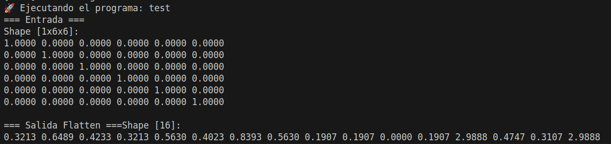
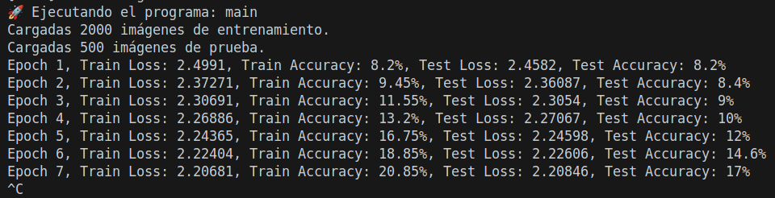

# CNN - Forward

By Leon Davis.

Este proyecto implementa una red CNN (solo forward) entrenada para reconocer dígitos del 0 al 9 utilizando el dataset MNIST. Se ha desarrollado en C++ usando CMake como sistema de construcción y OpenCV para el manejo de imágenes.

## 🔧 Requisitos

* CMake >= 3.10
* OpenCV >= 4.0

Asegúrate de tener instalados los requisitos antes de compilar.

## Instalación

Clona el repositorio y entra en la carpeta del proyecto:

```bash
git clone https://github.com/LeonDavisCoropuna/MLP-Multi-Layer-Perceptron.git
cd MLP-Multi-Layer-Perceptron
```

Dale permisos de ejecución al script principal:

```bash
chmod +x run.sh
```

Ejecuta el script para compilar y correr (test o main):

```bash
./run.sh main
```


### 1. Implementación
Este documento describe la implementación de tres componentes fundamentales para redes neuronales convolucionales:
1. Capa convolucional (`Conv2DLayer`)
2. Capa de pooling máximo (`PoolingLayer`)
3. Capa de aplanamiento (`FlattenLayer`)

### 2. Implementación de la Convolución 2D

#### 2.1. Estructura de la Capa Convolucional
La clase `Conv2DLayer` implementa la operación de convolución discreta 2D con las siguientes características:
- Soporte para múltiples canales de entrada y salida
- Inicialización de pesos con el método He normal
- Aplicación opcional de funciones de activación

```cpp
Conv2DLayer(int in_channels, int out_channels, int kernel_size, 
            int in_height, int in_width, 
            ActivationFunction* act = nullptr, 
            Optimizer* opt = nullptr)
```

#### 2.2. Proceso de Convolución (Forward Pass)
El método `forward` implementa la operación principal:

1. **Validación de dimensiones**:
   - Verifica que el tensor de entrada tenga las dimensiones esperadas `[in_channels, in_height, in_width]`

2. **Operación de convolución**:
   - Seis bucles anidados implementan:
     - Canales de salida (co)
     - Posiciones espaciales (h, w)
     - Canales de entrada (ci)
     - Posiciones del kernel (kh, kw)

3. **Cálculo de cada elemento de salida**:
   ```cpp
   sum += inputs.data[ci*in_height*in_width + input_h*in_width + input_w] * 
          weights.data[co*in_channels*kernel_size*kernel_size + 
                      ci*kernel_size*kernel_size + 
                      kh*kernel_size + kw];
   ```

4. **Aplicación de activación**:
   ```cpp
   outputs.data[co*out_height*out_width + h*out_width + w] = 
       activation ? activation->activate(sum) : sum;
   ```

#### 2.3. Ejemplo Numérico
Para una entrada de 1×3×3 (1 canal, 3×3) y filtro 2×2:
```
Entrada: [ [1, 2, 3],
           [4, 5, 6],
           [7, 8, 9] ]
Filtro: [ [0.1, 0.2],
          [0.3, 0.4] ]
Salida: [ [1*0.1 + 2*0.2 + 4*0.3 + 5*0.4, ...],
          ... ]
```

### 3. Implementación del Pooling Máximo

#### 3.1. Estructura de la Capa de Pooling
La clase `PoolingLayer` implementa pooling máximo con:
- Soporte para tamaño de kernel configurable
- Stride configurable
- Validación estricta de dimensiones

```cpp
PoolingLayer(int channels, int in_height, int in_width, 
             int kernel_size = 2, int stride = 1)
```

#### 3.2. Proceso de Pooling (Forward Pass)
El método `forward` implementa:

1. **Validación de dimensiones**:
   - Comprueba que las dimensiones de entrada sean compatibles con el kernel y stride

2. **Pooling máximo**:
   - Para cada ventana del kernel:
     - Encuentra el valor máximo
     - Guarda el índice de la posición máxima para backpropagation

3. **Restricciones dimensionales**:
   ```cpp
   if ((in_height - kernel_size) % stride != 0 || 
       (in_width - kernel_size) % stride != 0) {
       throw std::invalid_argument("Incompatible dimensions");
   }
   ```

#### 3.3. Ejemplo Numérico
Para entrada 1×4×4, kernel 2×2, stride 2:
```
Entrada: [ [1, 2, 3, 4],
           [5, 6, 7, 8],
           [9,10,11,12],
           [13,14,15,16] ]
Salida: [ [6, 8],
          [14, 16] ]
```

### 4. Implementación de Flatten

#### 4.1. Estructura de la Capa
La clase `FlattenLayer` transforma tensores multidimensionales en vectores 1D:

```cpp
Tensor forward(const Tensor &input) {
    input_shape = input.shape;
    outputs = input;
    outputs.reshape({static_cast<int>(input.size())});
    return outputs;
}
```

#### 4.2. Ejemplo
Entrada 2×3×3 → Salida 18×1

## Ejemplo 1:

### Descripción del Ejemplo
Este ejemplo demuestra el procesamiento de una imagen de entrada 5×5 a través de una red neuronal minimalista compuesta por:
1. Una capa convolucional con 2 filtros
2. Una capa de pooling máximo
3. Solo se implementa el forward pass (propagación hacia adelante)

### Arquitectura de la Red
```cpp
MLP mlp(0, nullptr);
mlp.add_layer(new Conv2DLayer(1, 2, 3, 5, 5));  // Conv 1→2 canales, kernel 3×3
mlp.add_layer(new PoolingLayer(2, 3, 3, 3, 1));  // Pooling kernel 3×3, stride 1
```

### Flujo de Datos
1. **Entrada**: Tensor 1×5×5 (valores del 1 al 25)
2. **Capa Conv2D**:
   - Transforma 1 canal → 2 canales
   - Reduce dimensiones espaciales de 5×5 → 3×3 (kernel 3×3 sin padding)
   - Aplica pesos aleatorios inicializados con semilla fija (32)
3. **Capa Pooling**:
   - Operación máximo en ventanas 3×3
   - Reduce 3×3 → 1×1 por canal
   - Stride=1 permite operación sin errores dimensionales

### Resultados Obtenidos
```
Salida final (2x1x1):
2.26604 -0.670125
```

### Análisis de Resultados
1. **Dimensionalidad**:
   - La salida tiene tamaño 2×1×1 como se esperaba
   - 2 canales (uno por cada filtro convolucional)
   - 1×1 por el pooling agresivo

2. **Valores de Salida**:
   - Los valores (2.26604 y -0.670125) son consistentes con:
     - Pesos inicializados aleatoriamente (pero reproducibles por la semilla fija)
     - Operación de máximo sobre los feature maps intermedios
   - La diferencia entre canales muestra que los filtros aprenden características distintas

## Ejemplo 2: Procesamiento con Flatten para Redes Fully-Connected

### Objetivo
Este ejemplo demuestra cómo integrar una capa Flatten después de las capas convolucionales para preparar los datos para una red fully-connected, mostrando la transformación dimensional completa.

### Arquitectura Propuesta
```cpp
MLP mlp(0, nullptr);

// Bloques Convolucionales
mlp.add_layer(new Conv2DLayer(1, 4, 3, 6, 6));    // 4x4x4 (1x6x6 → 4x4x4)
mlp.add_layer(new PoolingLayer(4, 4, 4, 2, 2));   // 4x2x2

// Capa Flatten
mlp.add_layer(new FlattenLayer());                // 4x2x2 → 16

// Visualización
Tensor output = mlp.forward(input);
```

### Flujo de Transformación Dimensional
1. **Input**: `[1, 6, 6]` (1 canal 6×6)
2. **Conv2D**: 
   - 4 filtros 3×3 → `[4, 4, 4]` 
   - Cálculo: `(6-3)+1 = 4`
3. **Pooling**: 
   - MaxPool 2×2 stride 2 → `[4, 2, 2]`
   - Cálculo: `⌊(4-2)/2⌋+1 = 2`
4. **Flatten**: 
   - `[4, 2, 2]` → `[16]` (4×2×2=16)

### Resultado Esperado


### Análisis Clave
1. **Preservación de Información**:
   - El patrón diagonal de entrada se codifica en 16 características
   - Flatten mantiene la localidad espacial original (primeros 4 valores = esquina superior izquierda)

2. **Uso en Redes Completas**:
   ```cpp
   // Ejemplo de continuación para clasificación
   mlp.add_layer(new DenseLayer(16, 10, new Softmax()));
   ```

## Intento de entrenamiento


Si llega a entrenar pero la mejora es muy poca y costosa.

## 5. Conclusiones

1. Se implementó exitosamente la convolución 2D con soporte para:
   - Múltiples filtros (canales de salida)
   - Validación dimensional estricta
   - Inicialización adecuada de pesos

2. El pooling máximo incluye:
   - Configuración flexible de kernel y stride
   - Mecanismo para backpropagation (índices máximos)
   - Validación de compatibilidad dimensional

3. El código cumple con los requisitos solicitados:
   - Operaciones básicas de CNN
   - Manejo adecuado de dimensiones
   - Estructura clara y documentada


## Ver código en github:
La parte principal del código se encuentra en la carpeta models/ (MLP, layers) y en utils/ (optimizadores, funciones de perdida y activación)
```bash
https://github.com/LeonDavisCoropuna/MLP-Multi-Layer-Perceptron.git
```