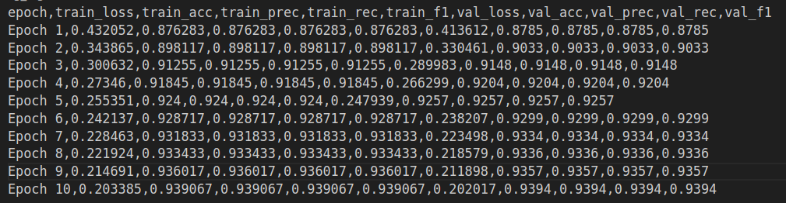

# CNN - Forward Activations & Poolling

By Leon Davis.

Este proyecto implementa una red CNN (solo forward) entrenada para reconocer dígitos del 0 al 9 utilizando el dataset MNIST. Se ha desarrollado en C++ usando CMake como sistema de construcción y OpenCV para el manejo de imágenes.

## 🔧 Requisitos

* CMake >= 3.10
* OpenCV >= 4.0

Asegúrate de tener instalados los requisitos antes de compilar.

## Instalación

Clona el repositorio y entra en la carpeta del proyecto:

```bash
git clone https://github.com/LeonDavisCoropuna/MLP-Multi-Layer-Perceptron.git
cd MLP-Multi-Layer-Perceptron
```

Dale permisos de ejecución al script principal:

```bash
chmod +x run.sh
```

Ejecuta el script para compilar y correr (test o main):

```bash
./run.sh main
```


### 1. Implementación
Este documento describe la implementación de tres componentes fundamentales para redes neuronales convolucionales:
1. Capa convolucional (`Conv2DLayer`)
2. Capa de pooling máximo (`PoolingLayer`)
3. Capa de aplanamiento (`FlattenLayer`)

### 2. Implementación de la Convolución 2D

#### 2.1. Estructura de la Capa Convolucional
La clase `Conv2DLayer` implementa la operación de convolución discreta 2D con las siguientes características:
- Soporte para múltiples canales de entrada y salida
- Inicialización de pesos con el método He normal
- Aplicación opcional de funciones de activación

```cpp
Conv2DLayer(int in_channels, int out_channels, int kernel_size, 
            int in_height, int in_width, 
            ActivationFunction* act = nullptr, 
            Optimizer* opt = nullptr)
```

#### 2.2. Proceso de Convolución (Forward Pass)
El método `forward` implementa la operación principal:

1. **Validación de dimensiones**:
   - Verifica que el tensor de entrada tenga las dimensiones esperadas `[batch_size, in_channels, in_height, in_width]`

2. **Operación de convolución**:
   - Seis bucles anidados implementan:
     - Canales de salida (co)
     - Posiciones espaciales (h, w)
     - Canales de entrada (ci)
     - Posiciones del kernel (kh, kw)

3. **Cálculo de cada elemento de salida**:
   ```cpp
   sum += inputs.data[ci*in_height*in_width + input_h*in_width + input_w] * 
          weights.data[co*in_channels*kernel_size*kernel_size + 
                      ci*kernel_size*kernel_size + 
                      kh*kernel_size + kw];
   ```

### 4. Implementación de Flatten

#### 4.1. Estructura de la Capa
La clase `FlattenLayer` transforma tensores multidimensionales en vectores 1D:

```cpp
Tensor forward(const Tensor &input) {
    input_shape = input.shape;
    outputs = input;
    outputs.reshape({static_cast<int>(input.size())});
    return outputs;
}
```

#### 4.2. Ejemplo
Entrada nx2×3×3 → Salida nx18, donde n es el batch_size

## Ejemplos

### Ejemplo 1: Sin activaciones y con Max Pooling

Este ejemplo demuestra el uso básico de una red convolucional sin funciones de activación y con una capa de **MaxPooling**. Se sigue de una capa de **Flatten** para convertir la salida final en un vector plano.

#### Arquitectura usada:

1. **Conv2DLayer**:

   * Input: 1 canal, imagen 6x6
   * Filtros: 5
   * Kernel: 3x3
   * Stride: 1
   * Padding: 0
     → Resultado: 5 mapas de 4x4

2. **MaxPooling**:

   * Tipo: MaxPooling
   * Tamaño del kernel: 2x2
   * Stride: 2
     → Resultado: 5 mapas de 2x2

3. **Flatten**:

   * Aplana la salida \[1, 5, 2, 2] → \[1, 20]

---

#### Entrada:

Imagen de 6x6 con un solo canal (batch size 1):

```
[[1, 2, 3, 4, 5, 2],
 [6, 7, 8, 9, 1, 3],
 [2, 3, 4, 5, 6, 4],
 [7, 8, 9, 1, 2, 1],
 [3, 4, 5, 6, 7, 2],
 [7, 5, 6, 1, 2, 3]]
```

---

#### Salida:

```txt
Output shape: 
1, 20, 
Output flatten: 
0.793082 -5.9289 -1.12534 -0.935543 -3.49811 
-2.28402 -0.958616 -0.183638 9.78294 2.67549 
4.25849 5.16243 -9.7859 -7.22758 -7.13639 
-3.12177 -9.05591 -12.3485 -11.4881 -8.56649
```

* No se usaron funciones de activación como ReLU, por eso algunos valores negativos permanecen.

* MaxPooling reduce el tamaño espacial pero retiene los valores más altos.

### Ejemplo 2: Con activación ReLU y Max Pooling

Este ejemplo muestra cómo usar una red convolucional con una **función de activación ReLU** seguida de una capa de **MaxPooling**. Finalmente, se usa una capa **Flatten** para convertir el resultado en un vector plano.

#### Arquitectura usada:

1. **Conv2DLayer**:

   * Input: 1 canal, imagen 6x6
   * Filtros: 5
   * Kernel: 3x3
   * Stride: 1
   * Padding: 0
   * Activación: **ReLU**
     → Resultado: 5 mapas de 4x4

2. **MaxPooling**:

   * Tipo: MaxPooling
   * Tamaño del kernel: 2x2
   * Stride: 2
     → Resultado: 5 mapas de 2x2

3. **Flatten**:

   * Aplana la salida \[1, 5, 2, 2] → \[1, 20]

#### Entrada:

Imagen de 6x6 con un solo canal (batch size 1):

```
[[1, 2, 3, 4, 5, 2],
 [6, 7, 8, 9, 1, 3],
 [2, 3, 4, 5, 6, 4],
 [7, 8, 9, 1, 2, 1],
 [3, 4, 5, 6, 7, 2],
 [7, 5, 6, 1, 2, 3]]
```

#### Procesamiento:

* **ReLU** elimina los valores negativos producidos por la convolución, manteniendo solo valores positivos.
* **MaxPooling** extrae el valor máximo de cada ventana de 2x2, reduciendo el tamaño espacial.
* **Flatten** convierte los mapas resultantes en un vector de una dimensión por muestra.

#### Salida:

```txt
Output shape: 
1, 20, 
Output flatten: 
10.6127 9.88491 12.8101 11.5919 14.9325 
8.56061 12.4502 10.3441 0 0 
0 0 21.007 19.4829 17.6718 
13.8947 18.2899 16.2002 20.1031 18.2886
```

* Los **valores en cero** indican posiciones donde la salida de la convolución fue negativa y fue anulada por **ReLU**.


### Ejemplo 3: Sin activaciones y con Average Pooling

En este ejemplo se muestra cómo aplicar una capa convolucional sin activación, seguida de **AveragePooling**. Esto es útil cuando queremos suavizar la información extraída sin eliminar valores negativos, como lo haría ReLU.

#### Arquitectura usada:

1. **Conv2DLayer**:

   * Input: 1 canal, imagen 6x6
   * Filtros: 5
   * Kernel: 3x3
   * Stride: 1
   * Padding: 0
   * Activación: **Sin activación**
     → Resultado: 5 mapas de 4x4

2. **Average Pooling**:

   * Tipo: AveragePooling
   * Kernel: 2x2
   * Stride: 2
     → Resultado: 5 mapas de 2x2

3. **Flatten**:

   * Aplana la salida \[1, 5, 2, 2] → \[1, 20]

---

#### Entrada:

Imagen de 6x6 con un solo canal (batch size 1):

```
[[1, 2, 3, 4, 5, 2],
 [6, 7, 8, 9, 1, 3],
 [2, 3, 4, 5, 6, 4],
 [7, 8, 9, 1, 2, 1],
 [3, 4, 5, 6, 7, 2],
 [7, 5, 6, 1, 2, 3]]
```

#### Procesamiento:

* **Convolución** calcula valores directamente sin activar (puede haber valores negativos).
* **AveragePooling** toma el promedio de cada región 2x2, resultando en una forma más suavizada del mapa.
* **Flatten** convierte el resultado final en un vector unidimensional.

#### Salida:

```txt
Output shape: 
1, 20, 
Output flatten: 
-3.62878 -0.616202 -3.53962 -0.841309 12.1367 
7.34708 10.1393 7.60364 5.37771 4.61682 
5.23455 3.93105 1.34808 -2.21956 -0.275996 
-0.16257 5.34664 2.83822 4.03089 4.50018
```

### Ejemplo 4: Con activación Sigmoid y Average Pooling

Este ejemplo implementa un pipeline donde se aplica una convolución con función de activación **Sigmoid**, seguida de una capa de **Average Pooling** y finalmente un **aplanamiento (flatten)**. Este flujo es útil cuando se desea una salida normalizada entre 0 y 1, lo cual puede ser útil para tareas de clasificación o detección temprana de patrones suaves.

#### Arquitectura usada:

1. **Conv2DLayer**:

   * Input: 1 canal, imagen 6x6
   * Filtros: 5
   * Kernel: 3x3
   * Stride: 1
   * Padding: 0
   * Activación: **Sigmoid**
     → Resultado: 5 mapas de 4x4 con valores en \[0, 1]

2. **Average Pooling**:

   * Tipo: Promedio (AVG)
   * Kernel: 2x2
   * Stride: 2
     → Resultado: 5 mapas de 2x2

3. **Flatten**:

   * Aplana la salida \[1, 5, 2, 2] → \[1, 20]

#### Entrada:

Imagen de 6x6 con un solo canal (batch size 1):

```
[[1, 2, 3, 4, 5, 2],
 [6, 7, 8, 9, 1, 3],
 [2, 3, 4, 5, 6, 4],
 [7, 8, 9, 1, 2, 1],
 [3, 4, 5, 6, 7, 2],
 [7, 5, 6, 1, 2, 3]]
```

#### Procesamiento:

* La activación **Sigmoid** transforma los valores de la convolución a un rango entre 0 y 1.
* **AveragePooling** suaviza estos mapas activados, produciendo un resumen por región.
* **Flatten** convierte el resultado en un vector para posibles capas densas.

#### Salida:

```txt
Output shape: 
1, 20, 
Output flatten: 
0.999984 0.606272 0.762367 0.989349 0.540815 
0.996577 0.963949 0.729454 0.00425285 0.000883663 
0.0011998 0.00469638 0.995544 0.94144 0.959841 
0.938997 2.23468e-05 0.00151703 9.12039e-05 0.00085884
```


* La **función Sigmoid** produce activaciones suaves y normalizadas, pero **puede saturarse** fácilmente, como se ve con algunos valores muy cercanos a 0 o 1.
* En conjunto con **AveragePooling**, los valores tienden a estabilizarse aún más, pero **la pérdida de información** puede aumentar si los mapas son muy pequeños.


Perfecto, Leon. Aquí tienes la documentación para el **Ejemplo 5**, que emplea la función de activación **Tanh** y usa **Average Pooling**:

---

## Ejemplo 5: Con activación Tanh y Average Pooling

Este ejemplo muestra el uso de la activación **Tanh** en una capa convolucional, seguida por una capa de **Average Pooling** y una **capa Flatten**. La función Tanh es útil cuando se requiere que las activaciones estén centradas en cero, lo cual puede ayudar a la convergencia durante el entrenamiento.

#### Arquitectura usada:

1. **Conv2DLayer**:

   * Input: 1 canal, imagen 6x6
   * Filtros: 5
   * Kernel: 3x3
   * Stride: 1
   * Padding: 0
   * Activación: ✅ **Tanh**
     → Resultado: 5 mapas de activación de 4x4 en el rango \[-1, 1]

2. **Average Pooling**:

   * Tipo: Promedio (AVG)
   * Kernel: 2x2
   * Stride: 2
     → Resultado: 5 mapas de 2x2

3. **Flatten**:

   * Convierte la salida \[1, 5, 2, 2] → \[1, 20]

#### Entrada:

Imagen 6x6 con un solo canal (batch size 1):

```
[[1, 2, 3, 4, 5, 2],
 [6, 7, 8, 9, 1, 3],
 [2, 3, 4, 5, 6, 4],
 [7, 8, 9, 1, 2, 1],
 [3, 4, 5, 6, 7, 2],
 [7, 5, 6, 1, 2, 3]]
```

---

#### Procesamiento:

* **Tanh** normaliza los valores de activación a un rango entre -1 y 1, centrándolos alrededor de cero.
* **Average Pooling** reduce dimensionalidad promediando los valores en cada región.
* **Flatten** transforma la salida en un vector para su uso en capas densas o clasificación.

---

#### Salida:

```txt
Output shape: 
1, 20, 
Output flatten: 
1 1 1 1 -0.909747 -0.998934 -0.999856 -0.999682 
-0.491054 -0.109679 -0.766465 0.00354612 -0.00429182 
-0.173439 -0.101511 -0.499644 -0.999908 -0.509348 
-0.999943 -0.432831
```

* La salida muestra cómo **Tanh satura** en ±1 cuando las activaciones de la convolución son muy grandes o pequeñas.
* Es útil cuando se quiere mantener la señal centrada y simétrica, aunque puede saturarse más que ReLU o Sigmoid.

## Intento de entrenamiento


Ahora si llega a entrenar y las métricas se guardan en training_log.csv

## 5. Conclusiones

1. Se implementó exitosamente la convolución 2D con soporte para:
   - Múltiples filtros (canales de salida)
   - Validación dimensional estricta
   - Inicialización adecuada de pesos

2. El pooling máximo incluye:
   - Configuración flexible de kernel y stride
   - Mecanismo para backpropagation (índices máximos)
   - Validación de compatibilidad dimensional

3. El código cumple con los requisitos solicitados:
   - Operaciones básicas de CNN
   - Manejo adecuado de dimensiones
   - Estructura clara y documentada


## Ver código en github:
La parte principal del código se encuentra en la carpeta models/ (model,trainer, layers) y en utils/ (optimizadores, funciones de perdida y activación y otros)
```bash
https://github.com/LeonDavisCoropuna/MLP-Multi-Layer-Perceptron.git
```