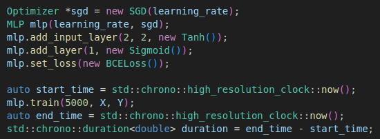
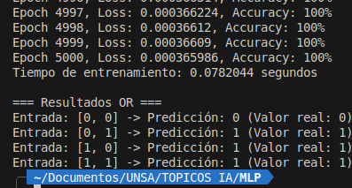
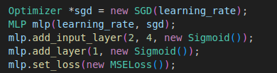
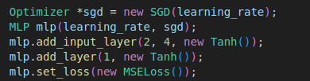
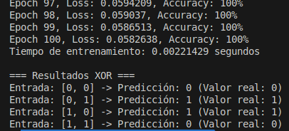
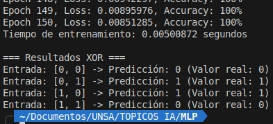

# MLP para Clasificación XOR en C++ by Leon Davis

Este proyecto implementa una red neuronal Multicapa Perceptrón (MLP) desde cero en C++ para resolver el problema de clasificación XOR. El proyecto utiliza CMake para la construcción y gestión de dependencias.

## Requisitos
- Compilador C++ compatible con C++17 (g++, clang, etc.)
- CMake (versión 3.10 o superior)
- Git

## Instalación y Ejecución

1. Clona el repositorio:
```bash
git clone https://github.com/tu_usuario/mlp-xor-cpp.git
cd MLP
```

2. Dale permisos de ejecución al script de configuración:
```bash
chmod +x run.sh
```

3. Finalmente ejecute el script para compilar y ejecutar el proyecto (por defecto se ejecuta ./xor):
```bash
./run.sh
```


## Estructura del Proyecto
```
.
├── images/                  # Resultados visuales
│   └── result.png           # Gráfico de resultados
├── models/                  # Implementaciones de modelos
│   ├── MLP.hpp              # Red neuronal multicapa
│   ├── perceptron.hpp       # Perceptrón básico
│   └── singleLayerPerceptron.hpp # Perceptrón de una capa
├── utils/                   # Utilidades auxiliares
│   ├── activations.hpp      # Funciones de activación
│   ├── load_dataset.hpp     # Carga de datos
│   ├── loss.hpp            # Funciones de pérdida
│   └── optimizer.hpp       # Algoritmos de optimización
├── CMakeLists.txt           # Configuración de CMake
├── main.cpp                # Punto de entrada principal
├── README_XOR.md           # Documentación adicional
├── run.sh                  # Script de compilación automática
├── training_outputs.txt    # Registro de salidas del entrenamiento
└── xor.cpp                 # Implementación específica para la actividad propuesta
```

## Actividad

Completar la siguiente lista de ejercicios:

1. **Arquitectura MLP para XOR**  
   Implementar una red con la siguiente estructura:  
   - 2 neuronas de entrada
   - 2 neuronas en capa oculta
   - 1 neurona de salida
   
     

   - La arquitectura crea un instancia de MLP y se le envía el learning rate junto con el optimizador, luego se añaden las capas según lo indicado. El primer parametro representa el número de entradas a la neurona, en este caso 2 (pares de {0,0}, {0,1}, etc). Luego se añaden las capas con una función de activación y se escoje una función de pérdida, para este ejemplo se uso BCE (Binary cross-entropy).

2. **Entrenamiento del modelo XOR**  
   - Implementar la función de propagación hacia adelante (forward pass)
   - Implementar el algoritmo de backpropagation para ajuste de pesos
   - Entrenar el modelo hasta convergencia
   
     

3. **Pruebas con compuertas lógicas**  
   - Entrenamiento de AND
      
   - Entrenamiento de OR
      

   - En ambos casos se alcanza un accuracy del 100%.
4. **Funciones de Activación**  
   En este caso se esta optando por una capa de 4 neuronas debido a que en algunos casos con solo 2 neuronas no se llega a una convergencia ideal o se requieren demasiados epochs. Se usó un learning rate de 0.05 y MSE (Mean Square Error) como función de pérdida.
   - **Sigmoide**: Implementación clásica para problemas binarios, la menos eficiente en este caso, pero cambiando de parametros es más eficiente.

     
     

   - **Tanh**: Versión centrada en cero del sigmoide, basado en estos parametros es la función que menos epochs requiere.

     
     

   - **ReLU**: Muy útil en la mayoría de los casos sobretodo cuando hay muchas capas conectadas y/o con muchas neuronas por capa, sin embargo, si se opta por una configuración de solo 2 neuronas en la capa oculta no se llega a una convergencia ideal.
   
     
     
